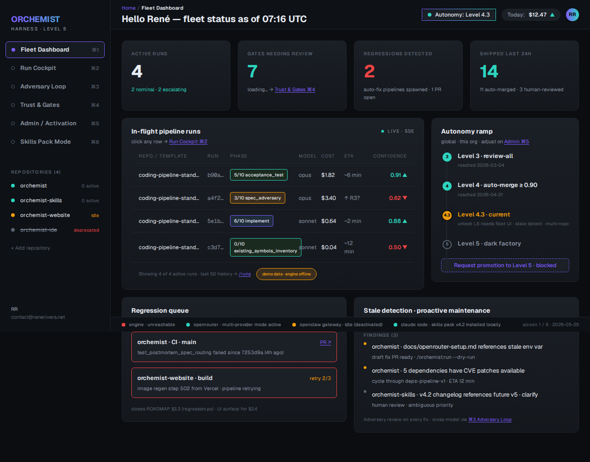
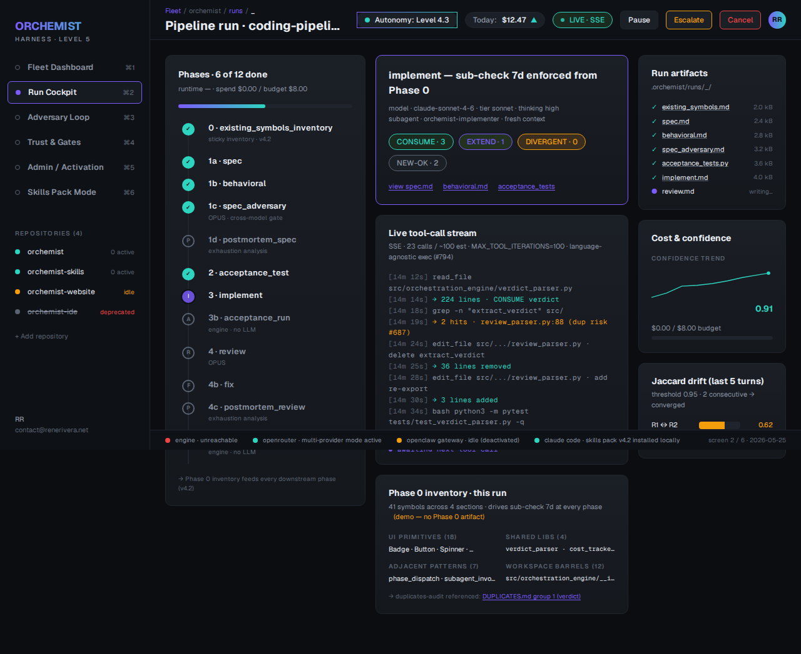
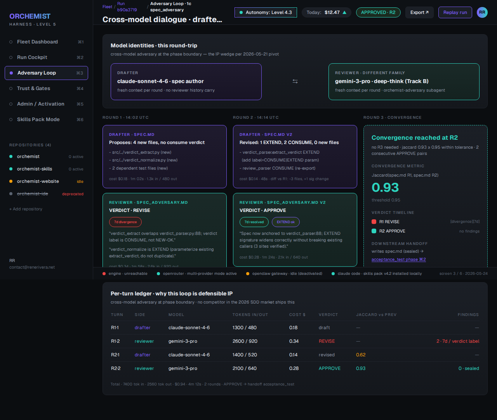
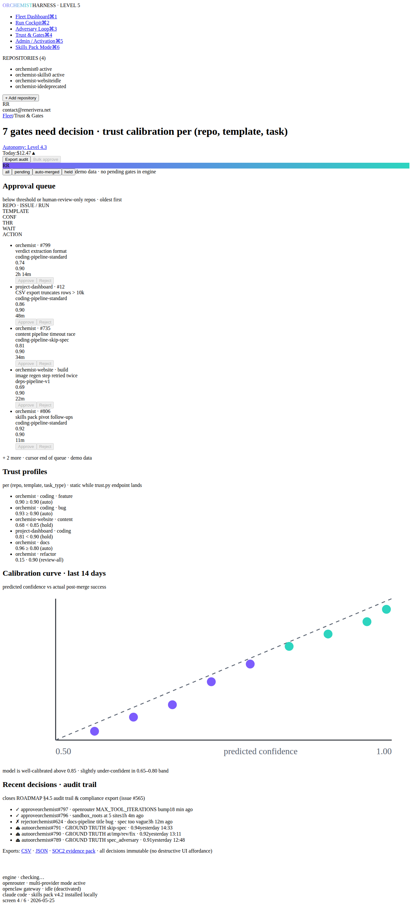
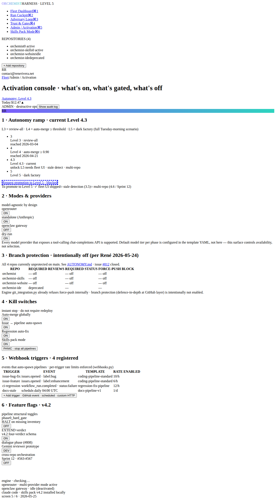
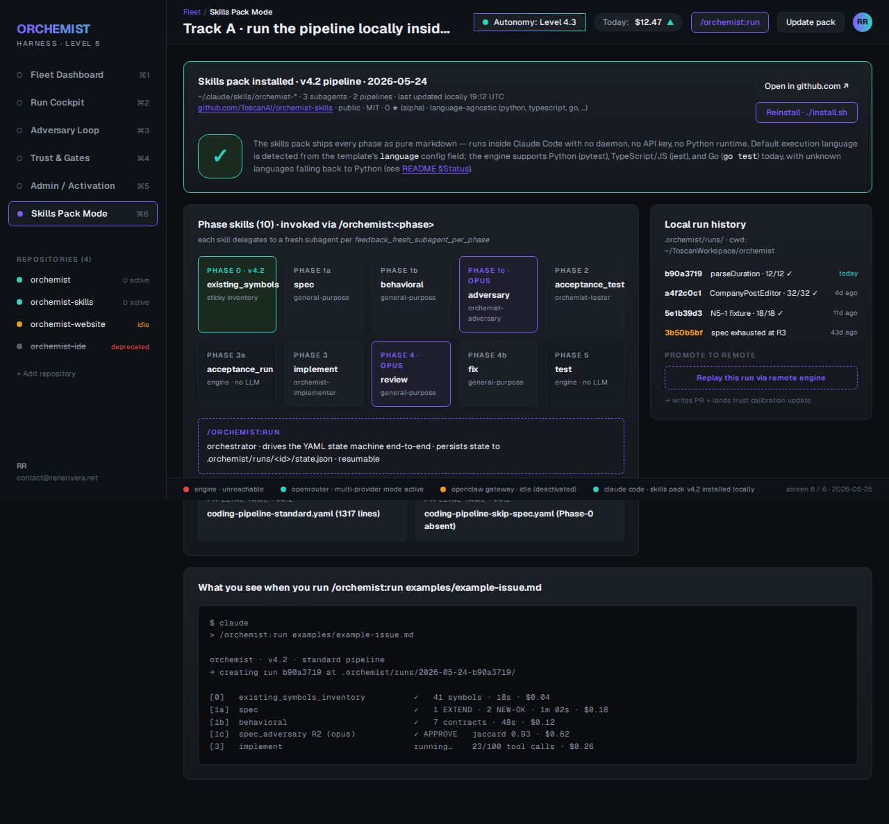
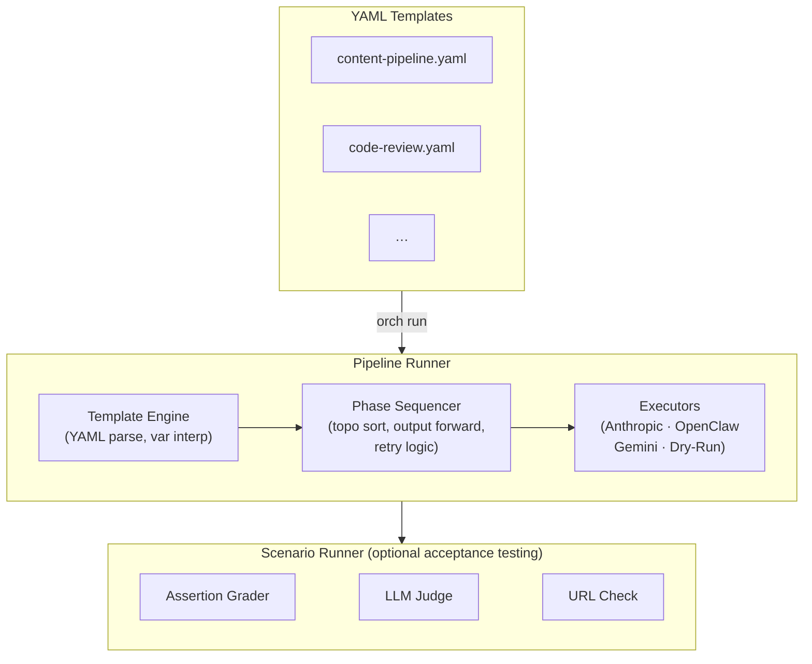

# Orchemist

### Scenario-driven orchestration for multi-agent AI pipelines.

[](https://github.com/ToscanAI/orchemist/actions/workflows/ci.yml)
[](https://pypi.org/project/orchemist/)
[](LICENSE)
[](https://www.python.org/downloads/)


---

## Why Orchemist?

AI agents hallucinate, drift off-topic across long chains, and produce work that looks correct until you test it. Orchemist solves this with three architectural principles:

- **Ground-truth anchoring.** Every phase prompt is anchored to the original issue body. Agents cannot invent features that aren't in the spec.
- **Adversarial quality gates.** Spec adversary, acceptance-test adversary, and code review phases catch weaknesses BEFORE they become implementation bugs.
- **Acceptance-test-driven development.** Tests are written before implementation by a separate agent. The implementing agent must pass them — it cannot modify or bypass them.

300+ pipeline runs across content, coding, research, and compliance workflows have validated this approach.

---

## What Is It?

**Orchemist** is a platform with four components:

1. **Orchestration Engine** (this repo) — a Python engine that sequences multi-phase AI pipelines from YAML templates. Handles phase transitions, retries, tool execution, cost tracking, and adversarial review loops.
2. **Pipeline Templates** (`templates/`) — YAML definitions for coding, content, research, and compliance pipelines. The coding pipeline (`coding-pipeline-standard`) runs 11 phases: spec, behavioral contracts, adversary review, acceptance tests, implementation, test execution, code review, fixes, and final verification.
3. **Skills Pack** ([ToscanAI/orchemist-skills](https://github.com/ToscanAI/orchemist-skills)) — the coding pipeline repackaged as Claude Code `.claude/skills/` and `.claude/agents/`. Pure markdown, no Python runtime. Drop it into Claude Code and `/orchemist:run` walks the same 11-phase loop. Best on-ramp if you already use Claude Code.
4. **Harness** (`frontend/` in this repo) — the operator web surface. Six cross-linked screens covering fleet status, run cockpit, the cross-model adversary dialogue visualizer, trust & gates, admin / activation, and skills-pack mode. Ships with the engine; launches via `orch serve`. See **[The Harness](#the-harness)** below for screenshots.

> The legacy [ToscanAI/orchemist-ide](https://github.com/ToscanAI/orchemist-ide) VS Code fork is being sunset in favour of the harness. See issue [#814](https://github.com/ToscanAI/orchemist/issues/814) for the deprecation plan.

You declare your pipeline in a single YAML file. The engine handles phase sequencing, dependency resolution, output forwarding, automatic retries, tool-calling, and scenario grading.

### Execution modes

| Mode | Backend | Status |
|---|---|---|
| **openclaw** | Claude sub-agents via OpenClaw gateway | Battle-tested (300+ runs) |
| **openrouter** | Any model via OpenRouter (Anthropic, OpenAI, Google, etc.) | New — first successful end-to-end coding pipeline run 2026-04-17 |
| **standalone** | Direct Anthropic API | Available for simple pipelines |
| **dry-run** | Mock execution for template validation | Stable |

> **Note:** The YAML below is simplified for illustration. Orchemist's template format is evolving to support an expanding range of workloads — from content pipelines to coding, research, compliance, and beyond. See [Template Authoring](docs/template-authoring.md) for the full schema and working examples.

```yaml
name: content-pipeline
phases:
  research:
    prompt: "Research the topic: {{brief}}"
    model_tier: haiku

  draft:
    prompt: "Write a 500-word article based on: {{research.output}}"
    model_tier: sonnet
    depends_on: [research]

  edit:
    prompt: "Polish and improve this draft: {{draft.output}}"
    model_tier: sonnet
    depends_on: [draft]
```

---

## Quickstart

```bash
pip install orchemist
orch new --yes --output templates/my-pipeline.yaml
orch run templates/my-pipeline.yaml --mode dry-run
```

No API key needed for a dry run:

```bash
orch run templates/my-pipeline.yaml --mode dry-run --input '{"brief": "AI safety"}'
```

Live run against Claude:

```bash
export ANTHROPIC_API_KEY="sk-ant-..."
orch run templates/my-pipeline.yaml --mode standalone --input '{"brief": "AI safety"}'
```

### Using OpenRouter (multi-provider)

To route through OpenRouter instead of calling Anthropic directly, export an OpenRouter key and select `--mode openrouter`:

```bash
export OPENROUTER_API_KEY="sk-or-v1-..."
orch run templates/my-pipeline.yaml --mode openrouter --input '{"brief": "AI safety"}'
```

`orch serve` captures environment variables at startup — export the key *before* launching the server, and restart it if you rotate the key. See [docs/openrouter-setup.md](docs/openrouter-setup.md) for the full configuration reference, CLI-flag precedence, and troubleshooting.

---

## The Harness

`orch serve` opens the **Orchemist Harness** — a six-screen operator surface designed against the canonical mockups in [`docs/harness-redesign-2026-05-24/screens/`](docs/harness-redesign-2026-05-24/screens). Every screen falls back to demo data when the engine is unreachable so the UI never blanks out; live screenshots against a real `orch serve` are checked in under [`docs/harness-redesign-2026-05-24/screenshots/live/`](docs/harness-redesign-2026-05-24/screenshots/live).

### 1. Fleet Dashboard

Multi-repo status, in-flight pipeline runs, autonomy-level ramp, regression queue, and stale-detection findings — all at a glance.



### 2. Run Cockpit

Live phase-by-phase progress for a single pipeline run, with the Phase 0 existing-symbols inventory, sub-check 7d verdict chips (CONSUME / EXTEND / DIVERGENT / NEW-OK), the live tool-call stream, sealed artifact list, and a Jaccard drift indicator.



### 3. Adversary Loop visualizer

The marquee screen — the cross-model drafter ↔ reviewer dialogue. Each round shows the proposed spec, the reviewer's verdict, and the Jaccard convergence metric. This is the *trust-engine wedge* in operation: a Claude drafter critiqued by a Gemini reviewer (or any other model family) at the spec→implementation boundary, with full per-turn cost ledger.



### 4. Trust & Gates

Operator queue for pipeline runs awaiting a human decision, with per-row Approve / Reject calls into `/api/v1/gates/{run_id}/(approve|reject)`. Side panel shows per-(repo, template, task) trust profile and a 14-day calibration curve.



### 5. Admin / Activation

The control surface: autonomy ramp (Level 3 → 5), execution-mode toggles (openrouter / standalone / openclaw / dry-run — the harness is model-agnostic by design), branch-protection audit, kill switches, webhook trigger CRUD, and feature flags for the v4.2 pipeline (`phase0_hard_gate`, `EXTEND` verdict, dialogue phase, cross-repo orchestration).



### 6. Skills Pack Mode

Mirror of the local Claude Code Skills Pack installation. Shows phase skills, pipeline YAMLs, local run history, and the `/orchemist:run` invocation preview. Lets operators "promote to remote" — replay a local run via the engine for trust calibration.



> **Try it.** `pip install orchemist[web] && orch serve` opens the harness at <http://127.0.0.1:8374>. With the engine running, every screen consumes real `/api/v1/*` data; without it, the same screens still render with demo data and a clear "engine offline" banner so the UI is reviewable end-to-end. A Playwright e2e suite (`frontend/tests-e2e/`) keeps both the offline-mock screenshots and the live-engine screenshots in sync with the SVG canon on every PR.

---

## Use Cases

| Use Case | What it does |
|----------|-------------|
| **Content Pipeline** | Research → Draft → Edit → SEO → Publish-ready output |
| **Code Review** | Static analysis → Security scan → Architecture review → Summary report |
| **Coding Pipeline** | Feature development → Unit tests → Integration tests → Deployment |
| **Research Assistant** | Query expansion → Source gathering → Synthesis → Citation check |
| **Translation Pipeline** | Translate → Back-translate → Consistency check → Final polish |
| **Customer Support** | Intent classification → KB lookup → Response draft → Quality gate |
| **Financial Analysis** | Data extraction → Trend analysis → Risk assessment → Executive summary |

Each use case is a template. Browse them with `orch templates list` or search with `orch templates search <topic>`.

---

## Features

- ✅ **YAML-first pipeline definitions** — version-controlled, diff-friendly, no code required
- ✅ **Phase sequencing with dependency graphs** — topological sort, parallel wave execution
- ✅ **Model tier selection per phase** — haiku / sonnet / opus, set per phase or pipeline-wide
- ✅ **`skill_refs` injection** — pass tool contexts into prompts declaratively
- ✅ **Fallback executors** — Gemini fallback when Anthropic is unavailable
- ✅ **Template index & search** — community index, install by GitHub shorthand `user/repo`
- ✅ **Scenario-based grading** — YAML acceptance criteria, LLM judges, assertion graders
- ✅ **Human-in-the-loop** — pause phases for review, inject feedback, resume
- ✅ **OpenClaw integration** — run phases as sub-agents with full tool access
- ✅ **Local web UI** — browse templates, start runs, and watch live progress in your browser (`orch serve`)

---

## How It Compares

| Feature | Orchemist | LangGraph | CrewAI | Autogen | Dify |
|---------|:-------------------:|:---------:|:------:|:-------:|:----:|
| YAML-first | ✅ | ❌ | ❌ | ❌ | Partial |
| Visual builder | 🔜 | ⚠️ | ❌ | ❌ | ✅ |
| Template library | ✅ | ❌ | ❌ | ❌ | ✅ |
| Testing / grading | ✅ | ❌ | ⚠️ | ❌ | ❌ |
| Raspberry Pi support | ✅ | ⚠️ | ⚠️ | ⚠️ | ❌ |

> ✅ full support · ⚠️ partial/unofficial · ❌ not supported · 🔜 planned

---

## Architecture



**Three execution modes:**

| Mode | How it runs | API key? | Start here? |
|------|-------------|----------|-------------|
| `standalone` | Direct Anthropic API (zero framework deps) | Yes — `ANTHROPIC_API_KEY` | ✅ Yes — simplest setup |
| `dry-run` | Mock executor for testing / CI | No | ✅ Yes — no credentials needed |
| `openclaw` | Sub-agent spawning via OpenClaw gateway | No (uses gateway token) | Requires separate [OpenClaw](https://github.com/openclaw/openclaw) setup |

> **New here?** Start with `--mode standalone` (bring your own API key) or `--mode dry-run` (no credentials). OpenClaw mode is for production deployments with the OpenClaw gateway.

---

## CLI Reference

```bash
# Create a new pipeline template (interactive wizard)
orch new

# Non-interactive scaffold with defaults
orch new --yes --output ./templates/my-pipeline.yaml

# Clone an existing template as a starting point
orch new --from content-pipeline

# Interactive wizard (config_schema-driven)
orch start

# Copy a starter pipeline to your project in one command
orch quickstart

# Execute a pipeline
orch run <template-or-file> --mode standalone --input '{"brief": "..."}'
orch run <template-or-file> --mode dry-run
orch run <template-or-file> --mode openclaw

# Validate a template (checks YAML syntax + structural rules)
orch validate <template-or-file>
orch validate <template-or-file> --fix    # auto-correct simple issues

# Show execution order and model tiers
orch list-phases <template-or-file>

# Browse templates
orch templates list
orch templates info <name>
orch templates search <query>

# Install / remove templates
orch templates install user/repo          # GitHub shorthand
orch templates install https://github.com/user/repo
orch templates install ./my-template.yaml --name my-pipeline
orch templates uninstall <name>

# Task queue (for async / long-running workflows)
orch submit --type <type> --payload '{"key": "value"}'
orch status [task-id]
orch list [--state running] [--type llm_call]
orch cancel <task-id>
orch retry <task-id>
orch watch <task-id> --follow
orch health
```

---

## Installation

Three install paths, ordered by setup cost. Most readers want **Path A** if they already use Claude Code.

### Path A — Claude Code Skills Pack (no Python, ~1 minute)

If you already have [Claude Code](https://claude.com/claude-code), the simplest way to try the Orchemist coding pipeline is the Skills Pack — pure markdown, no engine, no server, BYO model:

```bash
git clone https://github.com/ToscanAI/orchemist-skills.git
cd orchemist-skills
./install.sh                 # drops skills into ~/.claude/skills/ and ~/.claude/agents/
claude                       # then: /orchemist:run examples/example-issue.md
```

Trades off: no web UI, no queue, no daemon, no multi-provider model selection. Use the engine (Path B / C) for those.

### Path B — From PyPI (engine + CLI, ~5 minutes)

```bash
pip install orchemist
orch --help
orch serve                   # local web UI at http://localhost:8000
```

### Path C — From Source (development, ~10 minutes)

```bash
git clone https://github.com/ToscanAI/orchemist.git
cd orchemist
python3 -m venv .venv && source .venv/bin/activate
pip install .
orch --help
```

---

## Relationship to OpenClaw

| Layer | Provides | Think of it as… |
|-------|----------|-----------------|
| **OpenClaw** | Sub-agent spawning, tool access, model switching | Operating System |
| **Orchemist** | Pipeline templates, phase sequencing, quality gates | Application Framework |
| **Scenario Runner** | Outcome-based testing, LLM judges, grading | Test Framework |

The engine works **standalone** (direct API) or **with OpenClaw** (sub-agent spawning). No vendor lock-in on the model provider side.

---

## Git as Runtime Dependency

Orchemist uses **git commits as the source of truth** for multi-phase pipeline handoff. Each pipeline phase commits its output, and the next phase reads from a specific commit hash — making stale reads structurally impossible and providing a full audit trail of every pipeline run.

**What this means in practice:**

- **Pipeline execution** (coding pipelines, spec loops) requires a git repository
- **Dry-run mode** does NOT require git — works anywhere
- **Standalone mode** with simple linear pipelines works without git
- **Git-based features:** commit-based phase handoff, diff-based adversary review, immutable test references

This is a deliberate architectural choice: git provides immutability, diffing, and audit trails that would otherwise require custom infrastructure. The trade-off is that production pipeline execution is coupled to git — which is already a prerequisite for coding pipelines (branch creation, commits, PRs).

> **Future:** Pluggable VCS backends are on the roadmap but not prioritized for initial release. If you need non-git support, open an issue.

---

## Current Status

Orchemist is in **active development (alpha)**. What works, what doesn't:

| Area | Status |
|---|---|
| Coding pipeline (openclaw mode) | Battle-tested across 300+ runs on content, coding, research, compliance pipelines |
| Coding pipeline (openrouter mode) | First successful end-to-end run 2026-04-17 — produced correct code with 32/32 acceptance tests passing |
| Pipeline templates | `coding-pipeline-standard` (11 phases) and `coding-pipeline-skip-spec` stable; content and research templates available |
| Web UI | Functional for template browsing, run monitoring, and pipeline launching |
| Orchemist IDE | Phases 2-5 complete (shell scaffold, pipeline explorer, live log streaming, template editor); schema-driven launch form in progress |
| OpenRouter tool calling | Shipped 2026-04-16 (PR #795) — 6 tools with path sandbox, retry, JSONL logging |
| Cost optimization | In progress — command/acceptance_run phases being routed away from LLM (#798) |
| Documentation | Partial — OpenRouter setup guide, getting started, template authoring available; end-to-end tutorial pending |
| Community templates | Not yet — contributions welcome |

Known limitations:
- Spec adversary occasionally doesn't comply with first-line verdict format (pipeline compensates via retry loops at cost of extra rounds)
- Cost reporting fallback overestimates by ~3x when OpenRouter doesn't return `usage.total_cost` (#801)
- Bash tool sandbox is a UX guardrail, not a security boundary — production deployments should use OS-level isolation (firejail, containers)

---

## Contributing

Pull requests are welcome! Here's how to get started:

```bash
git clone https://github.com/ToscanAI/orchemist.git
cd orchemist
pip install -e ".[dev]"
pytest
```

**Maintainers cutting a release:** see [docs/RELEASE-SOP.md](docs/RELEASE-SOP.md).

**Areas where contributions are especially welcome:**

- 📦 **Community templates** — add a YAML template to `templates/` and submit a PR
- 🧪 **Scenarios & rubrics** — improve grading quality for existing templates
- 🔌 **Executors** — add support for new model providers (Gemini, Mistral, local models)
- 📖 **Documentation** — improve examples, add tutorials, translate docs

**Filing issues:** Use the right template for the right pipeline:

| Issue type | Template | Pipeline |
|------------|----------|----------|
| Bug | Bug Report | `coding-pipeline-v1` |
| Feature / code change | Feature Request | `coding-pipeline-v1` |
| Documentation | Documentation Request | `docs-pipeline-v1` |
| Article / blog post | Content Request | `content-pipeline` |
| Research / analysis | Research Request | `research-competitive` |

Please read CONTRIBUTING.md for code style and PR guidelines.

---

## Documentation

- [Getting Started](docs/GETTING_STARTED.md) — detailed setup guide
- [Architecture](docs/ARCHITECTURE.md) — system design
- [API Reference](docs/api-reference.md) — CLI commands + Python classes
- [Web UI](docs/web-ui.md) — browser interface (`orch serve`)
- [Harness redesign pack](docs/harness-redesign-2026-05-24/) — vision, duplicate audit, frontend audit, autonomy posture, SVG canon, live screenshots
- [Tech Stack](docs/tech-stack.md) — dependencies and choices
- [Security Policy](SECURITY.md) — vulnerability reporting & supported versions

---

## License

MIT © [Conny Lazo](https://connylazo.com) & [Toscan](https://github.com/ToscanAI)

See [LICENSE](LICENSE) for the full text.

---

**Orchemist — Tests passing. 3 execution modes. Git-native pipeline handoff.**
