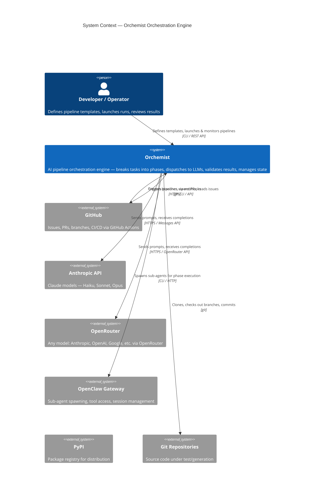
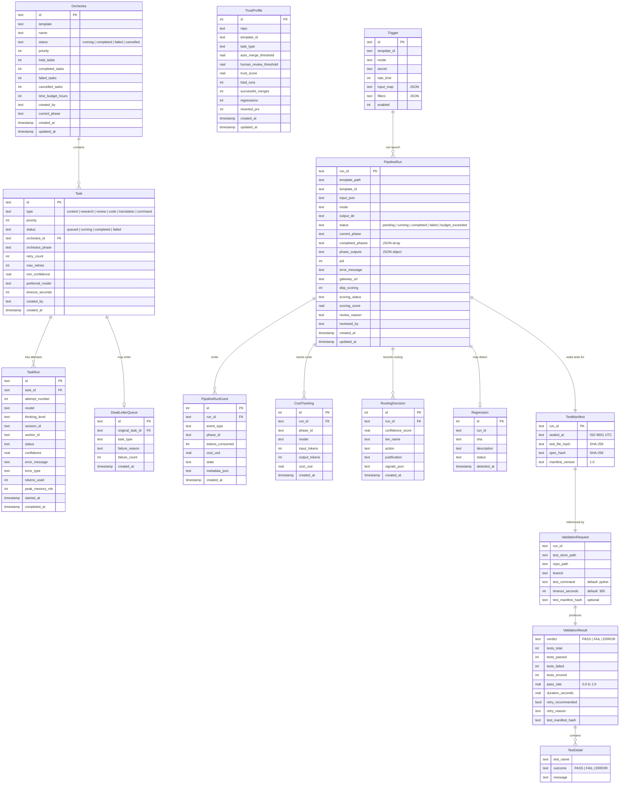

# Architecture — How It Works

> **Audience:** You've heard of AI agents. Maybe you've played with ChatGPT. You haven't necessarily built a pipeline system before. That's fine. This document explains how this engine works in plain language.

---

## What Is This?

This is an **orchestration engine** — a system that breaks a big task (say, "write me a well-researched LinkedIn article") into smaller steps, hands each step to an AI model, checks the quality of the result, and passes it along to the next step. Think of it like a small factory: raw material goes in one end, finished product comes out the other, with different workers handling different stations.

The key idea is that no single AI call does everything. Instead, one model researches, another writes, a third fact-checks, and a fourth polishes. Each model is chosen for the job: cheap and fast when that's enough, more powerful when the work is harder. The whole thing is driven by a plain YAML file — so you can define a new workflow without touching Python code.

---

## System Context — Where Orchemist Fits

The following C4 System Context diagram shows Orchemist and the external actors and systems it interacts with:



## Container Diagram — Inside Orchemist

This C4 Container diagram shows the major building blocks inside the engine:

```mermaid
C4Container
    title Container Diagram — Orchemist Internals

    Person(dev, "Developer / Operator", "")

    System_Boundary(orchemist, "Orchemist Orchestration Engine") {
        Container(cli, "CLI", "Python / Click", "orch run, launch, status, logs, wait, serve, mcp — primary user interface")
        Container(rest_api, "REST API + Web UI", "FastAPI / Jinja2", "HTTP endpoints for launching, monitoring, SSE live events, dashboard")
        Container(daemon, "Daemon", "Python", "Background process — executes pipeline runs, manages lifecycle, emits events")
        Container(sequencer, "Phase Sequencer", "Python", "State machine — walks phases in topological order, handles parallel waves, retries, transitions")
        Container(runner, "Pipeline Runner", "Python", "Dispatches TaskSpecs to executors, manages model escalation on failure")
        Container(template_engine, "Template Engine", "Python / YAML", "Loads, validates, and resolves pipeline templates with dependency graphs")
        Container(validator, "External Validator", "Python subprocess", "Isolated process — runs acceptance tests via pytest, communicates over JSON-RPC 2.0 stdin/stdout IPC")
        Container(test_store, "Immutable Test Store", "Python / Filesystem", "Seals acceptance tests as read-only with SHA-256 manifest integrity")
        Container(scoring, "Scoring & Grading", "Python", "Assertion grader, LLM judge, URL checker — computes weighted pass/fail scores")
        Container(db, "Database", "SQLite / WAL", "22+ tables: pipeline_runs, tasks, task_runs, events, cost_tracking, trust_profiles, regressions, …")
        Container(mcp, "MCP Server", "Python / FastMCP", "Model Context Protocol server — exposes pipeline operations as LLM-callable tools")

        Container(exec_openclaw, "OpenClaw Executor", "Python", "Spawns sub-agents via OpenClaw Gateway CLI or file-based IPC")
        Container(exec_anthropic, "Anthropic Executor", "Python / urllib", "Direct Anthropic Messages API calls, stdlib only")
        Container(exec_claudecode, "Claude Code Executor", "Python", "Invokes Claude Code CLI for coding tasks")
        Container(exec_openai, "OpenRouter Executor", "Python", "Routes to any model via the OpenRouter API; tool-calling parity")
        Container(exec_dryrun, "DryRun Executor", "Python", "Returns mock results for testing and CI")
        Container(exec_command, "Command Executor", "Python", "Runs allow-listed shell commands with shlex sandboxing")
        Container(fallback, "Fallback Handler", "Python", "Wraps primary executor; retries via alternative executor on rate-limit / timeout")
    }

    System_Ext(github, "GitHub", "Issues, PRs, branches")
    System_Ext(llm_anthropic, "Anthropic API", "Claude Haiku / Sonnet / Opus")
    System_Ext(llm_openai, "OpenRouter", "Any model family")
    System_Ext(openclaw_gw, "OpenClaw Gateway", "Sub-agent management")
    System_Ext(sqlite_file, "SQLite File", "~/.orchestration-engine/engine.db")

    Rel(dev, cli, "Runs commands", "Terminal")
    Rel(dev, rest_api, "Launches & monitors", "Browser / HTTP")
    Rel(cli, daemon, "Launches pipeline runs", "subprocess / PID file")
    Rel(cli, db, "Reads status, logs, events", "SQL")
    Rel(rest_api, daemon, "Launches runs", "subprocess")
    Rel(rest_api, db, "Queries state", "SQL")
    Rel(daemon, sequencer, "Drives phase execution", "in-process")
    Rel(sequencer, runner, "Submits TaskSpecs", "in-process")
    Rel(sequencer, template_engine, "Resolves templates & prompts", "in-process")
    Rel(sequencer, validator, "Sends ValidationRequest", "JSON-RPC 2.0 / stdin-stdout")
    Rel(validator, test_store, "Reads sealed tests, verifies hashes", "filesystem")
    Rel(runner, exec_openclaw, "Dispatches tasks", "in-process")
    Rel(runner, exec_anthropic, "Dispatches tasks", "in-process")
    Rel(runner, exec_claudecode, "Dispatches tasks", "in-process")
    Rel(runner, exec_openai, "Dispatches tasks", "in-process")
    Rel(runner, exec_dryrun, "Dispatches tasks", "in-process")
    Rel(runner, exec_command, "Dispatches tasks", "in-process")
    Rel(runner, fallback, "Wraps executor with retry", "in-process")
    Rel(daemon, scoring, "Scores pipeline output", "in-process")
    Rel(daemon, db, "Persists state, events, costs", "SQL")
    Rel(exec_openclaw, openclaw_gw, "Spawns sub-agents", "CLI / HTTP")
    Rel(exec_anthropic, llm_anthropic, "Sends prompts", "HTTPS")
    Rel(exec_openai, llm_openai, "Sends prompts", "HTTPS")
    Rel(daemon, github, "Creates branches, opens PRs", "gh CLI")

    UpdateLayoutConfig($c4ShapeInRow="4", $c4BoundaryInRow="1")
```



## The Big Picture — Pipeline Flow

Here's the full flow from your YAML file to a finished result, shown as the key building blocks above working together:

1. **You write a YAML template** defining phases, prompts, and models
2. **CLI or REST API** accepts the launch command and starts a **Daemon** process
3. **Template Engine** reads and validates the YAML, builds a dependency graph, computes execution order (topological sort)
4. **Phase Sequencer** walks through phases in order (or in parallel within a wave), fills in prompts with previous outputs, submits each phase as a TaskSpec
5. **Pipeline Runner** picks the right **Executor** for the task type, manages retries and model escalation
6. **Executors** call external LLMs or spawn sub-agents — results flow back as phase outputs
7. **External Validator** (optional) runs sealed acceptance tests in an isolated subprocess via JSON-RPC 2.0
8. **Scoring & Grading** evaluates the final output against acceptance criteria
9. Everything is **logged to SQLite** — every task, every retry, every cost, every event

---

## Data Model — Entity Relationships

The following diagram shows the core data entities and their relationships, covering both the database schema and the in-memory/IPC models used by the external validator (Sprint 8):



---

## Key Concepts

### Templates — The Playbook

A **template** is a YAML file that describes your entire pipeline. It's a recipe. It says: "first do this, then do that, and here's the prompt to use at each step."

Each template has:
- A unique **id** and **name** so you can refer to it
- A list of **phases** (the steps)
- Optionally, a **config schema** that documents what inputs the pipeline expects

Think of it like a stage directions script. The template doesn't execute anything — it just describes what should happen and in what order.

```yaml
id: my-pipeline
name: "My First Pipeline"
phases:
  - id: research
    name: "Research Phase"
    ...
  - id: write
    name: "Writing Phase"
    depends_on: [research]
    ...
```

The `depends_on` field is the critical piece: it tells the engine "don't start `write` until `research` is finished." The engine automatically figures out the right order using a standard algorithm (topological sort). If you have two phases that don't depend on each other, they're grouped into the same **wave** and executed **in parallel** by default (using a thread pool). You can control this with the `parallel`, `max_parallel`, and `fail_fast` fields on the pipeline template.

---

### Phases — The Steps

A **phase** is one unit of work inside a pipeline. Each phase:
- Has a **task type** (`research`, `content`, `code`, `review`, `translation`)
- Specifies a **model tier** — how capable the AI needs to be
- Has a **prompt template** — the instructions sent to the AI
- Has a **timeout** — how long to wait before giving up

The prompt template is a Python format string. You can embed variables like `{input[brief]}` (from your pipeline's initial input) or `{previous_output[research]}` (the output from an earlier phase). This is how data flows: phase outputs become inputs to the next phase's prompt.

If a referenced key is missing — say you reference `{previous_output[some_phase]}` but that phase hasn't run — the engine **fails the phase before dispatch** (a terminal `permanently_failed`), naming every `<MISSING:...>` marker so you can fix the template or input. This fail-fast guard (issues #535/#676) runs in every real execution mode (standalone / openrouter / openclaw / claudecode). **Dry-run is the one exception** (issue #659): it logs the missing markers and proceeds with placeholder text so you can smoke-test pipeline *structure* without supplying real inputs.

---

### Executors — The Workers

Executors translate a phase into a real model call. There are five concrete executors plus a dry-run mock; all five concrete ones share a small `BaseExecutor` mixin (`executors/_common.py`, #927):

| Executor | Module | What it does | When it's used |
|---|---|---|---|
| **AnthropicExecutor** | `executors/anthropic_executor.py` | Calls the Anthropic Messages API directly via stdlib `urllib` | `standalone` mode |
| **OpenRouterExecutor** | `executors/openrouter_executor.py` (+ `openrouter_tools.py`) | Routes to any model via OpenRouter; 6-tool tool-calling parity | `openrouter` mode — the primary production path |
| **GeminiCliExecutor** | `executors/gemini_cli_executor.py` | Bridges to the `gemini` CLI; no tool-calling/streaming/retry | dialogue-phase prototype (experimental, #677) |
| **ClaudeCodeExecutor** | `executors/claudecode_executor.py` | Calls Claude via the Claude Code MCP session (uses the user's subscription, no API key) | inside an active MCP tool handler |
| **OpenClawExecutor** | `openclaw_executor.py` | Spawns sub-agents via the OpenClaw CLI or file IPC | `openclaw` mode *(deprecated — gateway inactive)* |
| **DryRunExecutor** | `runner.py` | Returns mock results instantly | `dry-run` mode (testing/CI) |

The `AnthropicExecutor` is the primary executor for standalone use. It:
1. Resolves the model tier (`haiku` / `sonnet` / `opus`) to the exact Anthropic model string
2. Optionally enables extended thinking (2 K–32 K tokens budget)
3. Calls the Anthropic Messages API using only stdlib `urllib` — no third-party HTTP library required

The `OpenClawExecutor` is the integration executor. It:
1. Formats the phase prompt into a clean task
2. Tries to run `openclaw agent run` — a CLI that spawns a sub-agent
3. If the CLI isn't installed, it falls back to writing an `input.json` file to `~/.orchestration-engine/tasks/<id>/` and polling for an `output.json` file that another process will produce

This file-based handoff is a simple but robust integration contract: the engine and OpenClaw communicate through the filesystem, which means they can run in different processes, even on different schedules.

**Model escalation on failure:** If a task fails, the engine automatically retries with a more capable model. A content task might start on Haiku, fail, retry on Sonnet, fail again, and finally retry on Opus. This means you get cheap results when things go well and more thorough results when they don't — without manual intervention.

**Phase-level retry logic:** Independently from the executor-level retry, each phase in a template can declare its own `retries` count and `retry_delay_seconds` delay. When a phase fails, the sequencer retries it up to `retries` additional times (default 0 = no retries), waiting `retry_delay_seconds` between attempts. This is coarser-grained than the executor's internal retry but useful for transient network errors or model overload.

**Shared base (#927):** All five concrete executors subclass `BaseExecutor` (`executors/_common.py:47`), which hoists the genuinely-shared boilerplate — task-id resolution, start-time capture, and a single shared pricing table — without changing each executor's own init or call path. `DryRunExecutor` subclasses `TaskExecutor` directly.

**Template composition (#704):** Pipeline templates can compose via `extends:` and `exclude_phases:` (v0.12.0, #704). `templates/coding-pipeline-skip-spec.yaml` extends `coding-pipeline-standard`, excludes the spec-loop phases, and overrides a few — see [Template Authoring → Composition](template-authoring.md#composition).

**Model registry (#916):** Model tiers, ids, and prices live in a registry (`model_registry.py`, `models.py`, `pricing.yaml`, #916) rather than being hardcoded per-executor.

**Dialogue phase:** An experimental cross-model *dialogue* phase exists behind the `dialogue_phase` feature flag (default off, #808/#840); when the flag is off, any `type: dialogue` phase is skipped with a warning.

**Provider maturity:** Provider maturity is tiered (Anthropic and OpenRouter are production paths; Gemini-CLI and Claude-Code are experimental). Broadening the provider matrix — Ollama, more families, polish — is tracked in [#101](https://github.com/ToscanAI/orchemist/issues/101). See [Current State](CURRENT-STATE.md#executor-maturity).

---

### Graders — The Quality Checkers

Once a pipeline runs, how do you know the output is actually good? That's what **graders** are for. They're used by the Scenario Runner (see below), and there are three kinds:

**Assertion Grader** — Checks a Python expression against the output. For example:
```yaml
check: "len(output.get('article', '')) > 500"
```
This verifies the article is longer than 500 characters. The check runs inside a strict sandbox: only a small set of safe operations (comparisons, `len`, `str`, `int`, `bool`) are allowed. The expression is parsed into an AST (abstract syntax tree) first, and any dangerous operations (imports, class introspection, dunder methods) are blocked before the code ever runs.

**LLM Judge Grader** — Sends the output to a judge model along with a rubric. The judge reads the article and scores it 0.0–1.0. The rubric can be written in plain English: "Does this article cite its sources? Is the tone appropriate for LinkedIn?" The judge never sees the scenario's pass threshold or any pipeline metadata — only the article and the rubric. This "holdout principle" prevents the judge from gaming its own score.

**URL Check Grader** — Verifies that URLs mentioned in the article are real and reachable.

Each grader returns a score and a pass/fail decision. Some criteria can be **gates**: if a gate fails (e.g., the article is empty), the entire scenario fails immediately, regardless of how well the other criteria scored.

---

### Scenarios — The Acceptance Tests

A **scenario** is like a test case for your pipeline. It defines:
- What output to expect
- A list of acceptance criteria (using the graders above)
- A pass threshold (e.g., 75% weighted score required to pass)

You run scenarios after a pipeline to verify it's working correctly. This is the equivalent of unit tests, but for AI output.

```yaml
id: content-pipeline-happy-path
acceptance:
  - id: article-exists
    type: assertion
    check: "'article' in output"
    weight: 0   # gate: must pass or everything fails

  - id: factual-quality
    type: llm_judge
    rubric: "Rate factual accuracy from 0.0 to 1.0. Output: Score: X.X"
    weight: 3
    threshold: 0.7
```

A **suite** is a folder of scenarios. You can run all of them at once and get a satisfaction rate (e.g., "8 out of 10 scenarios passed").

---

## How a Pipeline Runs — Step by Step

Let's walk through the **content pipeline** template (`content-pipeline.yaml`) to make this concrete. Suppose you ask it to write a LinkedIn article about remote work trends.

### Phase 1: `research` (Sonnet)
The sequencer takes your input (`brief: "Remote work trends in 2025"`, `target_audience: "HR leaders"`) and fills it into the research prompt. A Sonnet sub-agent is spawned and told: "Research this topic. Find 10+ credible sources. Output a structured brief with citations, key facts, and statistics."

The result — a JSON blob with sources, facts, and data points — is stored in `phase_outputs["research"]`.

### Phase 2: `write` (Sonnet)
This phase depends on `research`, so it runs next. The sequencer fills in the write prompt with `{previous_output[research]}` — the full research brief from Phase 1. A Sonnet sub-agent writes the article draft: headline, intro, three sections, conclusion, sources.

The draft is stored in `phase_outputs["write"]`.

### Phase 3: `fact_check` (Sonnet)
This phase depends on *both* `write` and `research`. The prompt includes the draft article AND the research sources, and asks: "For each factual claim in the article, is it supported by the research? List issues. Give an accuracy score 0–100."

The result — a list of issues plus an accuracy score — is stored in `phase_outputs["fact_check"]`.

### Phase 4: `apply_fixes` (Sonnet)
Depends on `write` and `fact_check`. The prompt includes both the original draft and the list of fact-check issues. The sub-agent rewrites the article, fixing only the flagged inaccuracies while preserving the structure and tone.

### Phase 5: `final_output` (Sonnet)
Depends only on `apply_fixes`. The corrected article is polished for publication: proper headline, clean section headings, formatted Sources section. This is the final deliverable.

The entire pipeline returns a `phase_outputs` dict (every phase's result) plus a `final_output` pointing to Phase 5's result.

---

## The Database

The engine uses **SQLite** stored at `~/.orchestration-engine/engine.db`. SQLite is a file-based database — there's nothing to install or configure. It just works.

The database has grown to **22+ tables** as features have been added. The core tables are:

| Table | What's stored |
|---|---|
| `tasks` | Every task submitted: type, status, payload, retry count, model, cost |
| `task_runs` | Every execution attempt, including the model used, tokens consumed, cost, and error messages |
| `orchestras` | Multi-task pipeline workflows: which template, progress, budget |
| `dead_letter_queue` | Tasks that permanently failed after all retries, for analysis |
| `pipeline_runs` | Async pipeline run records (background execution via `orch launch`) |
| `pipeline_run_events` | SSE live-progress events for the web UI |
| `triggers` | Webhook trigger configurations |
| `cost_tracking` | Per-phase cost records for budget enforcement |
| `trust_profiles` | Per-(repo, template, task_type) trust calibration state |
| `diagnosis_results` | LLM-powered failure diagnosis records |
| `regressions` | Detected CI regressions with lifecycle tracking |
| `routing_decisions` | Confidence-based routing outcome log |

See `db.py` for the complete schema. Additional tables cover webhook invocations, failure patterns, review outcomes, reviewer calibration, trust adjustments, issue-pipeline mappings, sprint chain state, retry attempts, circuit breaker state, and error patterns.

Why store all this? A few reasons:
- **Retries**: If a task fails, the engine needs to know the retry count and when to try again
- **Auditing**: You can look back and see exactly what happened, what model was used, what it cost
- **Dead letter analysis**: Tasks that never succeed are preserved for inspection rather than silently dropped
- **Resume**: If the process crashes mid-pipeline, state is not lost

The database uses WAL (Write-Ahead Logging) mode, which means reads and writes don't block each other — important when multiple workers are running concurrently.

---

## Model Tiers

Three tiers are available. The right choice depends on what the task needs:

| Tier | Model | Speed | Cost | Best For |
|---|---|---|---|---|
| **Haiku** | `claude-haiku-4-5` | Fastest | Cheapest | Simple lookups, classification, translation, first attempts |
| **Sonnet** | `claude-sonnet-4-6` | Fast | Moderate | Writing, research, most production work |
| **Opus** | `claude-opus-4-8` | Slowest | Most expensive | Complex reasoning, final-resort retries, creative judgment |

> Exact model strings come from `config.py` / the model registry (#916) and track the latest releases; tier *names* (haiku/sonnet/opus) are stable.

In your YAML template, you set the tier per phase:
```yaml
model_tier: haiku    # or sonnet, or opus
thinking_level: low  # or medium or high
```

`thinking_level` controls how much "internal reasoning" the model does before answering. `low` is fast. `high` is thorough but slower and more expensive.

**Automatic escalation:** If a task fails and is retried, the engine escalates to the next tier automatically. A content task starts on Haiku, retries on Sonnet, final attempt on Opus. Code tasks start on Sonnet (they need more capability from the start). You don't have to configure this — it's built into the escalation paths.

---

## Security

This engine evaluates code (in the Assertion Grader) and spawns sub-processes. Here's what's done to keep that safe:

### AST-Validated Eval (Assertion Grader)
User-supplied expressions like `len(output['article']) > 500` are evaluated — but not blindly. The expression is first parsed into an abstract syntax tree (AST), and every node is checked against an allowlist. Allowed: comparisons, boolean ops, arithmetic, subscript access, `len`, `str`, `int`, `float`, `bool`. Blocked: imports, class access, dunder methods (`__import__`, `__class__`, `__builtins__`, etc.), file operations, anything not on the list. If a blocked construct is found, the expression is rejected before it ever runs.

### Path Traversal Protection (OpenClawExecutor)
When the executor writes task files to `~/.orchestration-engine/tasks/<task_id>/`, the task ID is validated against a strict regex (`^[a-zA-Z0-9_-]+$`). If the ID contains path components like `../../../etc/passwd`, it's replaced with a fresh UUID. After creating the directory, its resolved path is verified to be inside the tasks root — a defense-in-depth check that catches edge cases even if the ID validation passed.

### Input Sanitization (CommandExecutor)
Shell commands from task payloads are parsed with `shlex.split()` and executed with `shell=False` (`command_executor.py`). This means no shell interpretation: backticks, pipes, redirects, and semicolons are treated as literal characters, not shell operators. Additionally, only an allowlist of executables (`echo`, `ls`, `cat`, `python`, etc.) can be invoked.

### Rubric File Path Validation (Scenario Runner)
When a scenario references an external rubric file, the resolved path is checked to be within the scenarios directory. If the path escapes the directory (e.g., via `../../secret`), an error is raised rather than reading an arbitrary file.
