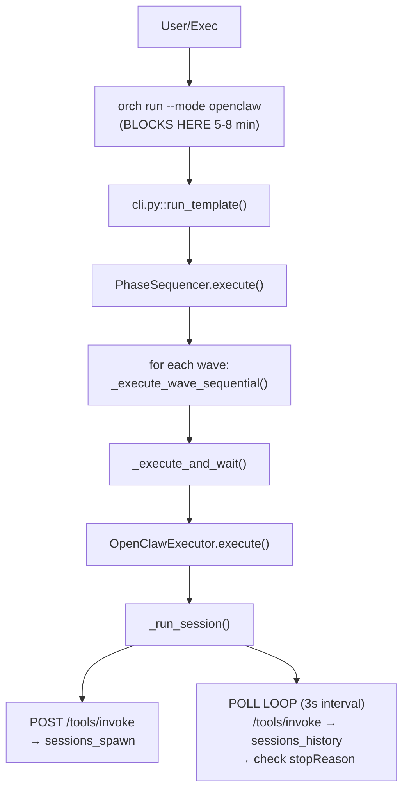

# Architecture Decision: Async Pipeline Execution

**Issue:** #267 — CLI process killed by exec timeout before pipeline completes  
**Author:** Architecture Auditor (sub-agent)  
**Date:** 2026-03-01  
**Original Status:** Recommendation  
**Current Status:** ✅ **IMPLEMENTED** — The non-blocking daemon approach is live in `daemon.py` (`orch launch` detaches, PID files, SIGTERM handling, DB-backed progress). `orch status` and `orch wait` poll the daemon's DB records.

---

## Problem Statement

`orch run --mode openclaw` blocks synchronously while sub-agents execute phases. A 5-phase pipeline takes 5–8 minutes, but the exec environment imposes a hard ~10-minute SIGKILL timeout. The orchestrating CLI process — which tracks progress and writes output — gets killed before completion.

**Key insight:** Sub-agents themselves complete fine. They're independent gateway sessions. Only the orchestrator process (the one tracking state and writing files) dies.

## Current Architecture (As-Is)



### Critical Call Chain

1. **cli.py `run_template()`** (~550 lines) — monolithic command that loads template, builds runner, calls `sequencer.execute()`, then writes outputs and displays summary.
2. **sequencer.py `PhaseSequencer.execute()`** — iterates waves, calls `_execute_and_wait()` per phase. All blocking.
3. **openclaw_executor.py `_run_session()`** — spawns a gateway session via `sessions_spawn`, then polls `sessions_history` every 3s until `stopReason ∈ {stop, end_turn, error, max_tokens}`.
4. **pipeline_runner.py** — thin factory that creates executor + in-memory DB + TaskQueue. Stateless adapter.
5. **db.py** — SQLite with WAL mode, supports `:memory:` (shared-cache URI), tasks/task_runs/orchestras tables. Currently used as ephemeral in-memory store during `orch run`.

### What Survives a Kill

- Sub-agent gateway sessions (independent processes)
- Nothing else. All state is in-memory (`:memory:` SQLite). Phase outputs written to disk mid-run (on_phase_complete callback) survive, but the final summary, scoring, and git merge gate do not.

---

## Option Analysis

### Option A: Phases Self-Chain

**Concept:** Each sub-agent, on completion, triggers the next phase via a webhook or gateway call. The DB tracks pipeline state. No long-running orchestrator needed.

#### How It Would Work

1. `orch start` writes run config (template, input, output_dir) to persistent DB, marks phase 1 as "pending"
2. Spawns phase 1 sub-agent with a webhook/callback instruction appended to its prompt
3. CLI exits immediately (~2s)
4. Phase 1 sub-agent completes → gateway fires webhook → webhook handler reads DB, builds phase 2 prompt, spawns phase 2
5. Repeat until all phases done

#### Assessment

| Criterion | Rating | Notes |
|-----------|--------|-------|
| **Implementation complexity** | 🔴 High | ~400-600 new LoC. Need: webhook server/handler, callback protocol, prompt injection for chaining, state machine in DB. New files: `webhook_handler.py`, `async_run.py`, `chain_protocol.py`. |
| **Reliability** | 🔴 Poor | Sub-agents are LLMs — they can't reliably execute webhook calls. No guaranteed callback mechanism in the OpenClaw gateway. If any phase fails to trigger the next, the pipeline stalls silently. No heartbeat = no detection. |
| **Compatibility** | 🔴 Low | Requires fundamentally different execution model. PhaseSequencer's prompt-building, supervisor hooks, git integration, and parallel wave execution would all need reimplementation inside the webhook handler. Essentially a rewrite. |
| **Testability** | 🟡 Medium | Webhook handler is testable in isolation. End-to-end testing requires a running gateway + sub-agents that actually complete. Hard to mock the full chain. |
| **Time to implement** | ~150K tokens, ~8-12 hours | High risk of scope creep. |

#### Fatal Flaw

The OpenClaw gateway has no native webhook/callback mechanism. Sub-agents can't reliably "call back" when done. We'd need to either: (a) build a webhook server that the gateway calls (gateway doesn't support this), or (b) have sub-agents themselves invoke a tool to trigger the next phase (unreliable — LLMs skip instructions). This option assumes infrastructure that doesn't exist.

**Verdict: ❌ Reject.** Requires non-existent gateway features and makes the pipeline fragile.

---

### Option B: Background Orchestrator Process

**Concept:** `orch start` spawns a background Python process (daemon/nohup) that drives the sequencer. The CLI returns immediately. Status is read from DB/output files.

#### How It Would Work

1. `orch start <template> --mode openclaw --input '{...}'` writes run config to persistent SQLite DB, spawns `orch _daemon <run-id>` via `subprocess.Popen(... start_new_session=True)` (or `nohup`), and exits
2. Background process runs the existing `PhaseSequencer.execute()` — same code path as today
3. Progress written to DB (new `pipeline_runs` table) and output files (same as today)
4. `orch status <run-id>` reads from DB and output dir
5. `orch logs <run-id>` tails the daemon's stdout/stderr log file
6. `orch wait <run-id>` polls DB until completion (optional, for scripts)

#### Assessment

| Criterion | Rating | Notes |
|-----------|--------|-------|
| **Implementation complexity** | 🟢 Low-Medium | ~200-300 new LoC. New: `_daemon` subcommand, `pipeline_runs` DB table, `start`/`status`/`logs` CLI commands. Modify: `cli.py` (add commands), `db.py` (add table + migration). No changes to sequencer/executor/runner. |
| **Reliability** | 🟢 Good | Background process is a normal Python process — survives parent death. PID file enables health checks. If daemon crashes, state in DB shows last completed phase. Can resume from last checkpoint. If host reboots, DB on disk survives — `orch resume <run-id>` can restart from the failed phase. |
| **Compatibility** | 🟢 Excellent | PhaseSequencer, OpenClawExecutor, git integration, supervisors, parallel waves — ALL unchanged. The daemon runs the exact same code path as `orch run`. Only the CLI entry point changes from "run inline" to "spawn background + poll status". |
| **Testability** | 🟢 Good | Unit test: `pipeline_runs` DB operations, PID management, status rendering. Integration test: spawn daemon with `--mode dry-run`, poll status, verify completion. Can reuse existing PhaseSequencer tests unchanged. |
| **Time to implement** | ~60-80K tokens, ~3-4 hours | Low risk. Mostly new code, minimal refactoring. |

#### Edge Cases

- **Daemon already running for same run:** Check PID file + `/proc/{pid}/cmdline`. Reject with clear error.
- **Daemon crashes mid-phase:** DB records last completed phase. `orch resume <run-id>` restarts from next phase. Sub-agents that were spawned keep running independently.
- **Multiple concurrent pipelines:** Each gets its own `run-id`, PID file, output dir. DB supports concurrent rows. No conflicts.
- **Log rotation:** Daemon logs to `output_dir/.orch-daemon.log`. Single file, capped at run lifetime.
- **Zombie processes:** `start_new_session=True` + double-fork pattern prevents zombies. PID file cleaned on exit.

**Verdict: ✅ Recommended.** Minimal changes, maximum compatibility, proven pattern.

---

### Option C: Cron-Based Polling

**Concept:** `orch start` writes run config to DB. A cron job (or systemd timer) periodically checks for active runs and advances phases.

#### How It Would Work

1. `orch start` writes run config to DB, exits immediately
2. Cron job runs `orch tick` every N seconds
3. `orch tick` queries DB for active runs, finds runs where current phase's sub-agent has completed (by checking gateway session status), advances to next phase
4. Each `orch tick` is a short-lived process (<30s)

#### Assessment

| Criterion | Rating | Notes |
|-----------|--------|-------|
| **Implementation complexity** | 🟡 Medium | ~300-400 new LoC. New: `tick` command, phase-state-machine in DB, session-status-check logic (decoupled from executor). Need to refactor `_run_session()` poll loop into a stateless "check once" function. |
| **Reliability** | 🟡 Mixed | Cron itself is reliable. But: each `orch tick` must reconstruct pipeline state from DB, re-resolve the template, rebuild prompts — all the work that PhaseSequencer does internally. Stateless ticks lose the in-memory context that makes prompt-building work (phase_outputs dict, pipeline_context, supervisor state). |
| **Compatibility** | 🔴 Low | PhaseSequencer is inherently stateful — it builds prompts using `self.phase_outputs`, runs supervisor loops, manages `pipeline_context` for git integration. A cron-based tick model would need to serialize/deserialize ALL of this state between ticks. Parallel wave execution becomes very complex (multiple concurrent sub-agents, all tracked in DB, all needing "check and advance" logic). |
| **Testability** | 🟡 Medium | Individual tick is testable. Full pipeline flow requires simulating multiple tick invocations with DB state changes between them. |
| **Time to implement** | ~120K tokens, ~6-8 hours | Medium-high risk. State serialization is the hard part. |

#### Fatal Flaw

The PhaseSequencer's `_build_phase_input()` method relies heavily on in-memory state: `self.phase_outputs` (dict of all prior results), `self.pipeline_context` (git branch info, diffs), supervisor retry counters, and the template engine's resolved prompt templates. Serializing all of this to DB between cron ticks — and ensuring it round-trips correctly — is equivalent to reimplementing the sequencer as a state machine. The prompt-building alone reads from 6+ sources (input, config, skill_context, file_context, previous_output proxy, pipeline_context). This is the wrong abstraction boundary.

**Verdict: ❌ Reject.** Fights the existing architecture instead of working with it.

---

## Recommendation: Option B — Background Orchestrator Process

### Implementation Plan

#### New Files

| File | Purpose | ~LoC |
|------|---------|------|
| `src/orchestration_engine/daemon.py` | Background process entry point, PID management, signal handling | ~120 |

#### Modified Files

| File | Changes | ~LoC delta |
|------|---------|------------|
| `cli.py` | Add `start`, `status <run-id>`, `logs <run-id>`, `wait <run-id>`, `resume <run-id>` commands. Refactor `run_template()` core logic into `_execute_pipeline()` helper shared by both `run` (inline) and daemon. | +150 |
| `db.py` | Add `pipeline_runs` table (run_id, template_path, input_json, mode, output_dir, status, current_phase, started_at, completed_at, pid, error_message). Add migration. | +60 |

#### No Changes Required

- `sequencer.py` — runs identically in background process
- `openclaw_executor.py` — runs identically in background process
- `pipeline_runner.py` — runs identically in background process
- `templates.py` — unchanged
- All existing tests — unchanged

### CLI Interface

```bash
# Launch pipeline in background (returns immediately)
orch start content-pipeline --mode openclaw --input '{"brief": "AI safety"}'
# → Pipeline run-id: a3f8c2d1
# → Status: orch status a3f8c2d1
# → Logs:   orch logs a3f8c2d1

# Check status
orch status a3f8c2d1
# → Pipeline: content-pipeline (5 phases)
# → Status:   running (phase 3/5: fact-check)
# → Elapsed:  4m 32s
# → Output:   ./output/content-pipeline-20260301-103301-a3f8c2d1/

# Tail logs
orch logs a3f8c2d1 --follow

# Block until completion (for scripts)
orch wait a3f8c2d1 --timeout 1800
# → exit 0 on success, exit 2 on failure

# Resume a crashed/interrupted run
orch resume a3f8c2d1
# → Resuming from phase 4/5 (fix)...

# Original inline mode still works (unchanged)
orch run content-pipeline --mode dry-run
```

### Database Schema Addition

```sql
CREATE TABLE IF NOT EXISTS pipeline_runs (
    run_id          TEXT PRIMARY KEY,
    template_path   TEXT NOT NULL,
    template_id     TEXT NOT NULL,
    input_json      TEXT NOT NULL,         -- JSON serialized input
    mode            TEXT NOT NULL,         -- standalone | openclaw | dry-run
    output_dir      TEXT NOT NULL,
    status          TEXT DEFAULT 'pending', -- pending | running | success | failed | cancelled
    current_phase   TEXT,                  -- phase_id currently executing
    completed_phases TEXT DEFAULT '[]',    -- JSON array of completed phase IDs
    phase_outputs   TEXT DEFAULT '{}',     -- JSON dict of phase_id → output (for resume)
    pid             INTEGER,              -- daemon process PID
    started_at      TIMESTAMP,
    completed_at    TIMESTAMP,
    error_message   TEXT,
    -- CLI options passthrough
    gateway_url     TEXT,
    gateway_token   TEXT,                 -- encrypted or omitted in status output
    skip_scoring    INTEGER DEFAULT 0,
    created_at      TIMESTAMP DEFAULT CURRENT_TIMESTAMP
);

CREATE INDEX IF NOT EXISTS idx_pipeline_runs_status
    ON pipeline_runs(status, created_at);
```

### State Persistence Flow

```
orch start                          daemon process
    │                                    │
    ├─ INSERT pipeline_runs              │
    │  (status='pending')                │
    ├─ spawn daemon ──────────────────→  │
    ├─ UPDATE status='running'           │
    └─ exit(0)                           │
                                         ├─ load template, build runner
                                         ├─ PhaseSequencer.execute()
                                         │    ├─ phase 1 starts
                                         │    │  UPDATE current_phase='research'
                                         │    ├─ phase 1 completes
                                         │    │  UPDATE completed_phases, phase_outputs
                                         │    ├─ phase 2 starts ...
                                         │    └─ ...
                                         ├─ on success:
                                         │  UPDATE status='success'
                                         │  write summary, scoring
                                         └─ on failure:
                                            UPDATE status='failed', error_message
```

### How the Caller Interacts

From the exec environment (OpenClaw main agent calling via `exec`):

```bash
# Fire and forget — completes in <3 seconds
exec("orch start pipeline.yaml --mode openclaw --input '{...}'")
# Returns run-id immediately

# Check later (in a heartbeat, follow-up message, etc.)
exec("orch status a3f8c2d1")
# Returns current state without blocking

# Or wait with a safe timeout (shorter than exec kill timeout)
exec("orch wait a3f8c2d1 --timeout 120")
# Blocks for up to 120s, returns current state
```

The key insight: **the exec timeout only matters for the initial `orch start` call** (which takes ~2s). The daemon runs independently as a system process, immune to exec timeouts.

### Failure Modes & Mitigations

| Failure | Detection | Mitigation |
|---------|-----------|------------|
| Daemon crashes mid-pipeline | `orch status` checks PID liveness via `os.kill(pid, 0)`. If PID dead + status still "running" → mark as "crashed". | `orch resume <run-id>` reads `completed_phases` from DB, skips them, restarts from next phase. |
| Host reboots | Same as crash — PID won't exist after reboot. | Same resume mechanism. DB is on-disk SQLite. |
| Sub-agent hangs | OpenClawExecutor already has per-phase timeout (default 1200s). | Timeout fires → phase marked failed → daemon writes error to DB → pipeline aborts. |
| Disk full | Output writes fail. | Daemon catches OSError, writes error to DB, exits with status='failed'. |
| Two daemons for same run | PID file check + DB status check before spawning. | Reject with "run already in progress" error. |
| Gateway down | OpenClawExecutor raises on HTTP errors. Phase retries handle transient failures. | After max retries exhausted, pipeline aborts. Status visible via `orch status`. |

### Implementation Sequence

1. **DB migration** — add `pipeline_runs` table (~30 min)
2. **daemon.py** — PID management, signal handling, main loop that calls refactored `_execute_pipeline()` (~1.5 hr)
3. **cli.py refactor** — extract `_execute_pipeline()` from `run_template()`, add `start`/`status`/`logs`/`wait`/`resume` commands (~2 hr)
4. **Tests** — unit tests for DB operations, daemon lifecycle; integration test with dry-run mode (~1 hr)

**Total estimate:** ~60-80K tokens, 3-4 hours via coding pipeline.

### Migration Path

- `orch run` (existing command) remains **100% unchanged** — backward compatible
- `orch start` is a new command — no breaking changes
- The persistent DB (`~/.orchestration-engine/engine.db`) already exists; just needs one new table
- Can ship incrementally: DB migration first, then `start` command, then `status`/`logs`/`wait`, then `resume`

---

## Appendix: Why Not Just Increase the Timeout?

The ~10-minute SIGKILL comes from the exec environment (OpenClaw's tool execution sandbox). Even if we could increase it:
- 5-phase pipelines already take 5-8 min; adding a 6th phase or a slow sub-agent pushes past any reasonable timeout
- The synchronous blocking model is fundamentally wrong for long-running workflows
- Background execution is the industry-standard solution (cf. `docker build`, `gh run`, `kubectl apply`)

The exec timeout is a symptom; the real problem is that `orch run` blocks.
