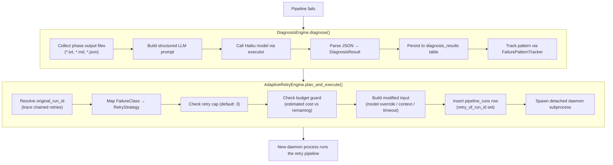

# Diagnosis & Recovery

> **Modules**: `orchestration_engine.diagnosis` (~560 lines),
> `orchestration_engine.adaptive_retry` (~700 lines)
> **Issues**: #3.1.1 (DB schema), #3.1.2 (LLM diagnosis engine), #3.1.3 (pattern tracking), #3.2.1 (retry planning), #3.2.2 (strategy executors), #3.2.3 (daemon integration), #396 (cost estimation)
> **Status**: Fully implemented — diagnosis, pattern tracking, adaptive retry, daemon integration

When a pipeline run fails the daemon automatically invokes a two-stage
recovery system: (1) an LLM-powered **diagnosis engine** classifies the
root cause and prescribes a remediation, then (2) an **adaptive retry
engine** translates the diagnosis into a concrete retry plan. If the
failure is retryable and within budget/cap limits, a new run is spawned
as a detached daemon subprocess — fully automated, no human intervention.

---

## Table of Contents

1. [Architecture Overview](#architecture-overview)
2. [Failure Classes](#failure-classes)
3. [Remediation Actions](#remediation-actions)
4. [Diagnosis Engine](#diagnosis-engine)
5. [Failure Pattern Tracking](#failure-pattern-tracking)
6. [Retry Strategies](#retry-strategies)
7. [Retry Plan](#retry-plan)
8. [Strategy → Input Mapping](#strategy--input-mapping)
9. [Adaptive Retry Engine](#adaptive-retry-engine)
10. [Daemon Integration](#daemon-integration)
11. [Database Schema](#database-schema)
12. [Model Escalation Ladder](#model-escalation-ladder)
13. [Cost Estimation](#cost-estimation)
14. [Design Decisions](#design-decisions)

---

## Architecture Overview



Both stages are **non-fatal** — failures at any point are logged and
swallowed so the parent run's terminal status is never retroactively changed.

---

## Failure Classes

**Enum**: `diagnosis.FailureClass` (inherits `str, Enum`)

| Value | Description |
|-------|-------------|
| `bad_prompt` | Phase prompt was ambiguous, incomplete, or incorrectly specified |
| `insufficient_context` | Model lacked necessary context (files, history, domain knowledge) |
| `wrong_model` | Selected model tier was unsuitable for the task complexity |
| `flaky_test` | Test failed non-deterministically, not due to a real regression |
| `infra_issue` | Infrastructure problem — API timeout, rate limit, network failure |
| `quality_gap` | Output was produced but fell below the required quality threshold |
| `timeout` | Phase or run exceeded its allotted time budget |
| `budget_exceeded` | Run exceeded its token or cost budget |

---

## Remediation Actions

**Enum**: `diagnosis.Remediation` (inherits `str, Enum`)

| Value | Description |
|-------|-------------|
| `retry_same` | Retry the failing phase with the same configuration |
| `retry_escalated_model` | Retry with a more capable (higher-tier) model |
| `retry_with_context` | Retry after injecting additional context into the prompt |
| `split_task` | Decompose the failing phase into smaller sub-tasks |
| `escalate_to_human` | Queue the run for human review; no automated recovery |
| `no_action` | Failure is terminal or expected; do nothing |

---

## Diagnosis Engine

**Class**: `diagnosis.DiagnosisEngine`

### Constructor

```python
engine = DiagnosisEngine(executor=my_executor, db=my_db)
```

- `executor` — any `TaskExecutor`-compatible object (Anthropic, OpenClaw, etc.)
- `db` — `Database` instance for persisting diagnosis records

### Flow: `diagnose(run_id, error_message, output_dir, template_id)`

1. **Collect phase context** — `_collect_phase_context(output_dir)`:
   - Reads all `*.txt`, `*.md`, `*.json` files from the output directory.
   - Each file truncated to **4 000 characters** with `... [truncated]` marker.
   - Sorted for determinism. Returns placeholder when no files found.

2. **Build prompt** — `_build_prompt(error_message, phase_context)`:
   - Uses `DIAGNOSIS_PROMPT_TEMPLATE` — a structured prompt asking the model to
     classify the failure and return a JSON object with `failure_class`,
     `remediation`, `confidence`, and `explanation`.

3. **Execute** — sends a `TaskSpec(type=ANALYSIS)` to the executor with
   `model_tier="haiku"` (lightweight, low-cost).

4. **Parse** — `_parse_llm_response(response_text)`:
   - Extracts JSON from the response.
   - Validates against `FailureClass` and `Remediation` enums.
   - **Fallback**: on any parse error, returns `INFRA_ISSUE` + `ESCALATE_TO_HUMAN`
     with `confidence=0.0` — failures are never silently dropped.

5. **Persist** — `db.insert_diagnosis(result.to_db_dict(run_id))`.

6. **Track pattern** — when `template_id` is provided, calls
   `FailurePatternTracker.track()` for systemic-failure detection (Issue #3.1.3).

### DiagnosisResult

```python
@dataclass
class DiagnosisResult:
    failure_class:   FailureClass    # root cause classification
    remediation:     Remediation     # recommended action
    confidence:      float           # [0.0, 1.0]
    explanation:     Optional[str]   # human-readable explanation
    model_used:      Optional[str]   # e.g. "claude-haiku-4-5-20241022"
    tokens_consumed: int             # 0 for rule-based diagnostics
```

Serialisation: `to_db_dict(run_id)` → dict with enum `.value` strings.

### Prompt Template

```
You are a pipeline failure analyst. Classify the failure below.

## Error Message
{error_message}

## Phase Outputs (truncated to 4000 chars each)
{phase_context}

## Classification Task
Respond ONLY with valid JSON matching this exact schema:
{
  "failure_class": "<one of: bad_prompt | insufficient_context | ...>",
  "remediation":   "<one of: retry_same | retry_escalated_model | ...>",
  "confidence":    <float between 0.0 and 1.0>,
  "explanation":   "<one sentence explanation>"
}
```

---

## Failure Pattern Tracking

**Class**: `diagnosis.FailurePatternTracker` (Issue #3.1.3)

Tracks recurring failure signatures per template to detect systemic issues.

### Normalisation

Before hashing, error messages are normalised by `_normalise_error()`:

| Pattern | Replacement | Purpose |
|---------|-------------|---------|
| UUIDs (`8-4-4-4-12` hex) | `<uuid>` | Strip run/session IDs |
| Hex addresses (8+ hex digits) | `<hex>` | Strip memory addresses |
| Unix file paths (`/a/b/c`) | `<path>` | Strip run-specific paths |
| Windows file paths (`C:\...`) | `<path>` | Strip run-specific paths |
| Multi-digit integers | `<int>` | Strip line numbers, ports |

After normalisation, the string is lower-cased, whitespace-collapsed, and
SHA-256 hashed. This ensures semantically identical errors from different
runs hash to the same bucket.

### Systemic Detection

A pattern is flagged **systemic** when:

- Same `(pattern_hash, template_id)` pair accumulates more than
  **`SYSTEMIC_THRESHOLD` = 3** occurrences
- Within **`SYSTEMIC_WINDOW_DAYS` = 7** days

When a pattern crosses into systemic territory, a `WARNING`-level log
is emitted:

```
Systemic failure detected — template=coding-pipeline-v1  class=timeout
  occurrences=4  hash=a1b2c3d4e5f6
```

### API

```python
tracker = FailurePatternTracker(db=db)
record = tracker.track(
    template_id="coding-pipeline-v1",
    failure_class="timeout",
    error_message="Phase 'build' timed out after 600s",
)
# record = {"pattern_hash": "...", "occurrence_count": 4, "is_systemic": 1, ...}
```

---

## Retry Strategies

**Enum**: `adaptive_retry.RetryStrategy` (inherits `str, Enum`)

| Value | Description |
|-------|-------------|
| `escalate_model` | Use a higher model tier (Haiku → Sonnet → Opus) |
| `add_context` | Inject additional context into the failing phase prompt |
| `split_task` | Decompose the failing phase into smaller sub-tasks (deferred) |
| `rephrase_prompt` | Rewrite the failing phase prompt to reduce ambiguity |
| `retry_unchanged` | Retry with identical configuration (for transient failures) |
| `increase_timeout` | Multiply the phase timeout budget |

### Default Strategy Map

`FailureClass` → `RetryStrategy` mapping (`None` = non-retryable):

| Failure Class | Retry Strategy | Rationale |
|---------------|----------------|-----------|
| `quality_gap` | `escalate_model` | Higher-capability model may produce better output |
| `wrong_model` | `escalate_model` | Explicitly needs a more capable tier |
| `insufficient_context` | `add_context` | Inject diagnosis explanation as extra context |
| `bad_prompt` | `rephrase_prompt` | Append retry context to help model self-correct |
| `flaky_test` | `retry_unchanged` | Transient — identical rerun likely to pass |
| `infra_issue` | `retry_unchanged` | Transient — network/API issues typically resolve |
| `timeout` | `increase_timeout` | Double the timeout budget (2× multiplier) |
| `budget_exceeded` | **None** | Non-retryable — spending more would make it worse |

---

## Retry Plan

**Dataclass**: `adaptive_retry.RetryPlan`

```python
@dataclass
class RetryPlan:
    strategy:           RetryStrategy   # which strategy to apply
    original_run_id:    str             # the failed run being retried
    model_override:     Optional[str]   # e.g. "claude-opus-4-6", or None
    extra_context:      Optional[str]   # text to inject, or None
    timeout_multiplier: float           # default 1.0 (no change)
```

- **Serialisation**: `to_json()` → JSON string; `from_json(raw)` → `RetryPlan`.
- **`model_override`** is only set when strategy is `ESCALATE_MODEL`.
- **`extra_context`** is only set when strategy is `ADD_CONTEXT`.
- **`timeout_multiplier`** is only set when strategy is `INCREASE_TIMEOUT`
  (default: `2.0`).

---

## Strategy → Input Mapping

Each strategy has a dedicated executor that transforms the original
pipeline input dict:

### `RETRY_UNCHANGED`
Deep copy of original `input_json` — no modifications.

### `ESCALATE_MODEL`
Sets `input_json["model_override"]` to the next tier from the escalation
ladder:
```python
result["model_override"] = plan.model_override
```

### `INCREASE_TIMEOUT`
Multiplies existing timeout fields by `plan.timeout_multiplier`:
- `timeout_seconds` → `int(value × multiplier)`
- `timeout_override` → `int(value × multiplier)` (fallback key)
- Neither exists → stores `timeout_multiplier` key for downstream

### `REPHRASE_PROMPT` / `ADD_CONTEXT`
Appends a structured `[RETRY CONTEXT]` block to `input_json["extra_context"]`:
```
[RETRY CONTEXT] Previous run failed with diagnosis: timeout.
Details: Phase 'build' exceeded the 600s time budget due to large repo size.
Please rephrase or clarify your response to address this issue.
```

### `SPLIT_TASK`
Deferred to a future issue — falls back to `RETRY_UNCHANGED` with a warning.

---

## Adaptive Retry Engine

**Class**: `adaptive_retry.AdaptiveRetryEngine`

### Constructor

```python
engine = AdaptiveRetryEngine(
    db=my_db,               # required for plan_and_execute()
    db_path="/path/to/db",  # passed to child daemon
    strategy_map=None,      # defaults to DEFAULT_STRATEGY_MAP
    timeout_multiplier=2.0, # for INCREASE_TIMEOUT strategy
)
```

### Low-Level: `plan(diagnosis, original_run_id, current_model)`

Pure business logic — no I/O:

1. Look up `diagnosis.failure_class` in the strategy map.
2. Return `None` if non-retryable (e.g. `BUDGET_EXCEEDED`).
3. Apply strategy-specific parameters:
   - `ESCALATE_MODEL` → resolve `model_override` via escalation ladder.
   - `ADD_CONTEXT` → build `extra_context` from diagnosis explanation.
   - `INCREASE_TIMEOUT` → set `timeout_multiplier`.
4. Return `RetryPlan`.

### High-Level: `plan_and_execute(diagnosis, run, run_id, max_retries=3)`

End-to-end retry orchestration:

1. **Resolve original run** — traces `retry_of_run_id` links back to the
   root run (so retry chains are capped against the original, not just
   the immediate parent).

2. **Derive plan** — calls `plan()`. Non-retryable → sets
   `status='escalated'` and returns.

3. **Check retry cap** — `count_existing_retries(original_run_id)`.
   If `existing_count >= max_retries` (default 3) → escalate.

4. **Check budget** — reads `budget_usd` or `cost_limit_usd` from
   `input_json`. If estimated retry cost exceeds remaining budget → escalate.

5. **Build retry input** — `build_retry_input(plan, run, diagnosis)`:
   dispatches to the appropriate strategy executor.

6. **Insert DB row** — `db.insert_pipeline_run()` with:
   - `run_id` = `"retry-{uuid8}-{original8}"`
   - `retry_of_run_id` = original run ID
   - `retry_strategy` = strategy enum value
   - `status` = `"pending"`

7. **Spawn daemon** — detached subprocess via `subprocess.Popen` with
   `start_new_session=True`.

### Escalation

When a failure is non-retryable, the retry cap is reached, or the budget
is insufficient, the engine sets the run's status to `"escalated"` —
signalling that human intervention is required.

---

## Daemon Integration

The diagnosis-and-retry flow runs in the `daemon.run_daemon()` failure
path, after the pipeline execution raises an exception or returns
`aborted=True`:

```python
# daemon.py — failure path (Issue #3.2.3)
if aborted or (result and result.get('aborted')):
    # 1. Persist failure status
    db.update_pipeline_run(run_id, status='failed', ...)

    # 2. Diagnose failure (non-fatal)
    _diagnosis = None
    try:
        from .diagnosis import DiagnosisEngine
        _diag_executor = runner.executors[0]
        _diag_engine = DiagnosisEngine(executor=_diag_executor, db=db)
        _diagnosis = _diag_engine.diagnose(
            run_id,
            error_message=msg,
            output_dir=str(output_dir),
            template_id=run.get('template_id'),
        )
    except Exception as _diag_exc:
        logger.warning("Diagnosis failed (non-fatal): %s", _diag_exc)

    # 3. Adaptive retry (non-fatal)
    if _diagnosis is not None:
        try:
            from .adaptive_retry import AdaptiveRetryEngine
            _retry_engine = AdaptiveRetryEngine(db=db, db_path=db_path)
            _retry_engine.plan_and_execute(_diagnosis, run, run_id)
        except Exception as _retry_exc:
            logger.warning("Adaptive retry failed (non-fatal): %s", _retry_exc)

    # 4. Post failure result to GitHub
    _post_github_result_hook(
        ..., diagnosis=_diagnosis, ...
    )
```

### Lifecycle Position

```
Pipeline FAILS
  → Mark status='failed' in DB
    → DiagnosisEngine.diagnose()
      → AdaptiveRetryEngine.plan_and_execute()
        → Post GitHub failure result (includes diagnosis)
          → PID cleanup + daemon exit
```

The diagnosis object is also passed to `_post_github_result_hook` so the
GitHub comment/status includes the failure classification and recommended
remediation.

---

## Database Schema

### `diagnosis_results` table (Issue #3.1.1)

| Column | Type | Description |
|--------|------|-------------|
| `id` | `INTEGER PK` | Auto-increment |
| `run_id` | `TEXT NOT NULL` | FK → `pipeline_runs.run_id` |
| `failure_class` | `TEXT NOT NULL` | Enum value (e.g. `"timeout"`) |
| `remediation` | `TEXT NOT NULL` | Enum value (e.g. `"increase_timeout"`) |
| `confidence` | `REAL NOT NULL` | [0.0, 1.0] |
| `explanation` | `TEXT` | LLM-generated explanation |
| `model_used` | `TEXT` | Model identifier |
| `tokens_consumed` | `INTEGER` | Default `0` |
| `created_at` | `TIMESTAMP` | Default `CURRENT_TIMESTAMP` |

**Index**: `idx_diagnosis_results_run_id ON diagnosis_results(run_id)`

**Query methods**:
- `insert_diagnosis(data)` → returns auto-incremented ID
- `get_diagnosis_by_run_id(run_id)` → most recent diagnosis (ORDER BY id DESC LIMIT 1)
- `list_diagnoses(failure_class?, remediation?, limit, offset)` → filtered + paginated

### `failure_patterns` table (Issue #3.1.3)

| Column | Type | Description |
|--------|------|-------------|
| `id` | `INTEGER PK` | Auto-increment |
| `pattern_hash` | `TEXT NOT NULL` | SHA-256 of normalised error |
| `template_id` | `TEXT NOT NULL` | Pipeline template identifier |
| `failure_class` | `TEXT NOT NULL` | Enum value |
| `occurrence_count` | `INTEGER` | Default `1` |
| `is_systemic` | `INTEGER` | `0` or `1` |
| `first_seen_at` | `TEXT NOT NULL` | ISO timestamp |
| `last_seen_at` | `TEXT NOT NULL` | ISO timestamp |

**Unique constraint**: `UNIQUE(pattern_hash, template_id)`
**Index**: `idx_failure_patterns_template ON failure_patterns(template_id, last_seen_at)`

### Retry columns on `pipeline_runs` (Migration 011, Issue #3.2.1)

| Column | Type | Description |
|--------|------|-------------|
| `retry_of_run_id` | `TEXT` | FK to original run being retried (`NULL` = first attempt) |
| `retry_strategy` | `TEXT` | `RetryStrategy` enum value (`NULL` = first attempt) |

**Index**: `idx_pipeline_runs_retry ON pipeline_runs(retry_of_run_id)`

**Query methods**:
- `count_retries_for_run(original_run_id)` → count of retry attempts

---

## Model Escalation Ladder

When the strategy is `ESCALATE_MODEL`, the engine picks the next tier
above the current model:

| Index | Model | Approximate Cost |
|-------|-------|-----------------|
| 0 | `claude-haiku-4-5-20241022` | $0.05/run |
| 1 | `claude-sonnet-4-6` | $0.15/run |
| 2 | `claude-opus-4-6` | $0.50/run |

**Rules**:
- If `current_model` is not in the ladder (or `None`): jump to top tier (Opus).
- If already at top tier: stays at Opus (no further escalation possible).
- `_next_model(current_model)` returns `ladder[min(idx+1, len-1)]`.

---

## Cost Estimation

**Method**: `AdaptiveRetryEngine.estimate_cost(model_override)`

Returns a heuristic USD cost estimate per retry run:

| Model | Estimated Cost |
|-------|---------------|
| `claude-haiku-4-5-20241022` | $0.05 |
| `claude-sonnet-4-6` | $0.15 |
| `claude-opus-4-6` | $0.50 |
| `None` or unknown | $0.50 (safe default — most expensive) |

The budget guard in `plan_and_execute()` reads `budget_usd` or
`cost_limit_usd` from the run's `input_json` and compares against the
estimated retry cost. When `budget > 0` and `estimated_cost > budget`,
the run is escalated instead of retried.

---

## Design Decisions

| Decision | Rationale |
|----------|-----------|
| **Haiku for diagnosis** | Lightweight model keeps diagnosis cost minimal (~$0.05). Classification accuracy is sufficient at this tier for structured JSON output. |
| **Safe fallback on parse failure** | Returns `INFRA_ISSUE` + `ESCALATE_TO_HUMAN` with `confidence=0.0` — diagnosis failures never silently drop. |
| **Error normalisation before hashing** | Stripping UUIDs, paths, hex addresses, and large integers ensures semantically identical errors from different runs hash consistently for pattern tracking. |
| **Systemic threshold = 3 in 7 days** | Balances sensitivity vs noise — a pattern recurring 3+ times in a week strongly suggests a template-level issue, not random flakiness. |
| **Retry cap of 3** | Prevents runaway retry loops. After 3 attempts, escalation to human is more productive than continued automated retries. |
| **Budget guard** | Retrying with Opus when the budget is nearly exhausted would waste money with no chance of success. Better to escalate. |
| **`retry_of_run_id` traces to original** | Chained retries (retry of a retry) all point back to the root run, so the cap is enforced globally, not per-hop. |
| **Non-fatal both stages** | The parent run is already marked `failed` before diagnosis starts. A diagnosis or retry failure should never change the parent's terminal status. |
| **`status='escalated'`** | A distinct status (not `failed`) so operators can filter for runs that need human attention vs. genuine pipeline failures. |
| **Detached daemon per retry** | Same isolation model as chain spawning — each retry is a fully independent process with its own PID file, log, and lifecycle. |

---

*Source files*:
`src/orchestration_engine/diagnosis.py` (DiagnosisEngine, FailurePatternTracker, enums),
`src/orchestration_engine/adaptive_retry.py` (AdaptiveRetryEngine, RetryPlan, strategy executors),
`src/orchestration_engine/daemon.py` (integration in failure path),
`src/orchestration_engine/db.py` (diagnosis_results, failure_patterns tables, retry columns)
