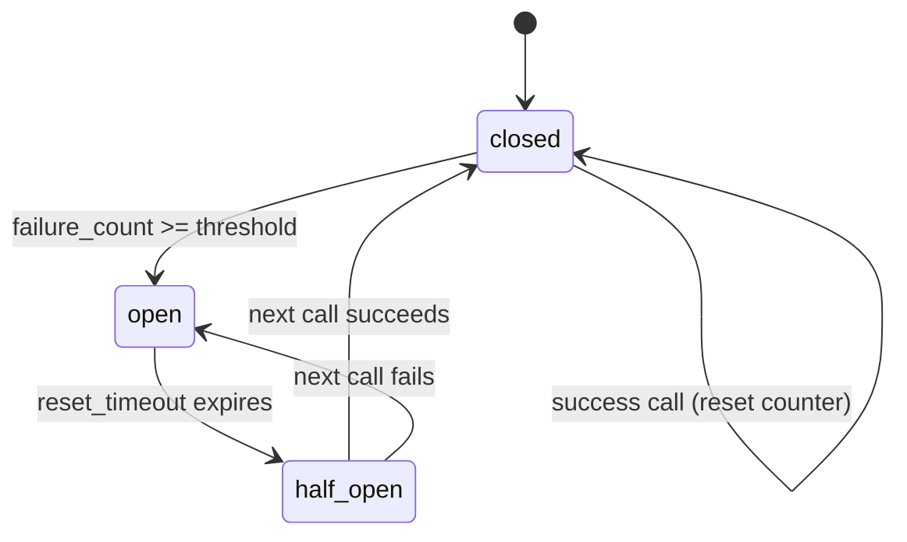
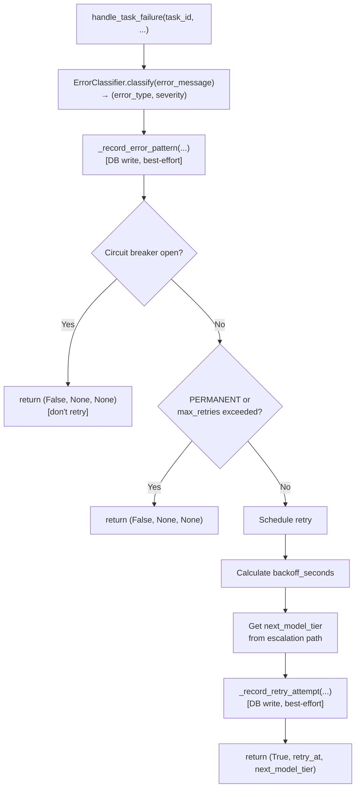
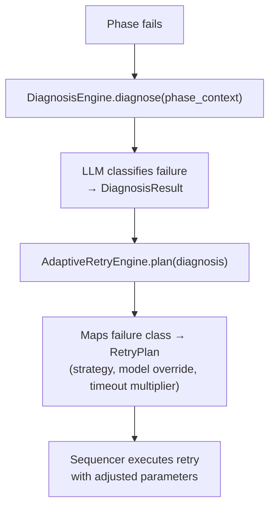

# Error Recovery and Retry Logic

The orchestration engine implements **robust error recovery mechanisms** with intelligent retry strategies, exponential backoff, circuit breakers, and model tier escalation. All state is thread-safe and persisted to SQLite.

## Implementation Status

**Implemented (`recovery.py`):**
- Error classification (keyword-pattern matching)
- Exponential backoff with configurable base/max
- Circuit breaker per `task_type:model_tier` key
- Model tier escalation on retry
- Thread-safe state via `threading.Lock`
- DB persistence: `retry_attempts`, `circuit_breaker_state`, `error_patterns`

**Not implemented (deferred):**
- Failure pattern analysis / learning
- Proactive failure prevention rules
- Human escalation notifications
- Failure pattern trends dashboard

## Error Classification

```python
class ErrorType(str, Enum):
    TRANSIENT = "transient"    # Temporary issues — retry with backoff
    PERMANENT = "permanent"   # Permanent failures — no retry, dead-letter
    QUALITY   = "quality"     # Low quality output — retry with better model
    RESOURCE  = "resource"    # Resource exhaustion — wait and retry
    TIMEOUT   = "timeout"     # Execution timeout — retry
    RATE_LIMIT = "rate_limit" # API rate limiting — backoff longer

class ErrorSeverity(str, Enum):
    LOW = "low" | MEDIUM = "medium" | HIGH = "high" | CRITICAL = "critical"
```

### Classification Rules (`ErrorClassifier`)

Pattern matching against the lowercased error message:

| Keywords | ErrorType | Severity | Max Retries | Notes |
|----------|-----------|----------|-------------|-------|
| `timeout`, `connection reset`, `network error`, `service unavailable` | TRANSIENT | MEDIUM | 3 | |
| `out of memory`, `resource exhausted`, `quota exceeded`, `capacity limit` | RESOURCE | HIGH | 5 | backoff ×3 |
| `rate limit`, `429`, `too many requests`, `throttle` | RATE_LIMIT | MEDIUM | 8 | backoff ×2.5 |
| `confidence too low`, `quality check failed`, `hallucination detected` | QUALITY | MEDIUM | 3 | escalate model |
| `task timeout`, `deadline exceeded` | TIMEOUT | MEDIUM | 2 | |
| `invalid task`, `authentication failed`, `permission denied`, `model not available` | PERMANENT | CRITICAL | 0 | dead-letter immediately |
| `model failure`, `system overload`, `repeated failures` | TRANSIENT | CRITICAL | 1 | triggers circuit breaker |
| (unknown) | TRANSIENT | MEDIUM | 3 | default fallback |

Context modifiers: Haiku model + generic "failed" → promotes to QUALITY.

## Retry Strategy

### Exponential Backoff

```python
backoff_seconds = min(
    config.retry.backoff_base * (2 ** attempt_number),
    config.retry.backoff_max
)
```

Defaults (from TOML config):
- `backoff_base = 1` second
- `backoff_max = 60` seconds

| Attempt | Delay |
|---------|-------|
| 1 | 2s |
| 2 | 4s |
| 3 | 8s |
| 4 | 16s |
| 5+ | 60s (capped) |

### Model Tier Escalation

On each retry, the task may be assigned a higher-capability model:

```python
ESCALATION_PATHS = {
    TaskType.CONTENT:     [HAIKU, SONNET, OPUS],
    TaskType.CODE:        [SONNET, OPUS, OPUS],
    TaskType.RESEARCH:    [HAIKU, SONNET, OPUS],
    TaskType.TRANSLATION: [SONNET, OPUS, OPUS],
    TaskType.REVIEW:      [SONNET, OPUS, OPUS],
}
```

Model escalation is always applied if:
- `error_type == QUALITY` and `models.escalation_enabled = true` in config

### Max Retries Per Task Type

| Task Type | Default Max Retries |
|-----------|---------------------|
| content | 3 |
| code | 2 |
| research | 3 |
| translation | 4 |
| review | 2 |

## Circuit Breaker Pattern

Circuit breakers prevent cascade failures by short-circuiting requests to a `task_type:model_tier` combination that has been repeatedly failing.

**Key design decision:** Only the **first failure of each unique task** increments the failure counter. Retries of the same task don't count again. This means the circuit reflects unique-task failure rate, not per-attempt failure rate.

### State Machine



**State transitions (`CircuitBreakerState`):**
- `record_failure(threshold)` — increments counter, opens if ≥ threshold
- `record_success()` — resets counter to 0, closes circuit
- `is_open(threshold, reset_timeout_minutes)` — returns True if open and timeout not elapsed

**Configuration:**
- `circuit_breaker_threshold` — failures before opening (default: 5)
- `circuit_breaker_reset_minutes` — how long until half-open (default: 30)

## `RecoveryManager` API

```python
class RecoveryManager:
    def __init__(self, database: Database, config: EngineConfig): ...
    
    def handle_task_failure(
        self,
        task_id: str,
        task_type: TaskType,
        error_message: str,
        model_tier: str = None,
        context: Dict[str, Any] = None
    ) -> Tuple[bool, Optional[datetime], Optional[str]]:
        """Returns (should_retry, retry_at, next_model_tier)"""
    
    def handle_task_success(
        self,
        task_id: str,
        task_type: TaskType,
        model_tier: str = None
    ) -> None:
        """Resets circuit breaker, clears retry state."""
    
    def get_retry_queue(self) -> List[Dict[str, Any]]:
        """Returns tasks ready for retry (scheduled_at <= now)."""
    
    def mark_retry_executed(self, task_id: str, success: bool) -> None:
        """Marks retry attempt as done in the DB."""
    
    def get_error_statistics(self) -> Dict[str, Any]:
        """Returns error type distribution, circuit breaker status, retry rates."""
```

### Failure Handling Flow



## Database Schema

Tables created and managed by `RecoveryManager`:

```sql
-- Retry attempt log
CREATE TABLE retry_attempts (
    id INTEGER PRIMARY KEY AUTOINCREMENT,
    task_id TEXT NOT NULL,
    attempt_number INTEGER NOT NULL,
    scheduled_at TIMESTAMP NOT NULL,
    executed_at TIMESTAMP,
    model_tier TEXT,
    error_type TEXT,
    error_message TEXT,
    backoff_seconds INTEGER,
    success BOOLEAN
);

-- Circuit breaker state (one row per key)
CREATE TABLE circuit_breaker_state (
    name TEXT PRIMARY KEY,    -- e.g. "content:haiku-4-5"
    failure_count INTEGER DEFAULT 0,
    last_failure TIMESTAMP,
    opened_at TIMESTAMP,
    state TEXT DEFAULT 'closed'  -- closed | open | half_open
);

-- Error frequency tracking for analysis
CREATE TABLE error_patterns (
    id INTEGER PRIMARY KEY AUTOINCREMENT,
    error_message TEXT NOT NULL,
    error_type TEXT NOT NULL,
    task_type TEXT,
    model_tier TEXT,
    frequency INTEGER DEFAULT 1,
    first_seen TIMESTAMP DEFAULT CURRENT_TIMESTAMP,
    last_seen TIMESTAMP DEFAULT CURRENT_TIMESTAMP,
    UNIQUE(error_message, task_type, model_tier)
);
```

## Thread Safety

`RecoveryManager` uses a single `threading.Lock` (`self._lock`) to protect:
- Read/write of `_retry_states` (in-memory dict)
- Read/write of `_circuit_breakers` (in-memory dict)
- The `is_first_failure` determination

DB writes use best-effort try/except — a DB contention error doesn't abort the recovery logic.

---

## Level 4 Recovery: Diagnosis + Adaptive Retry

The `RecoveryManager` above handles Level 3 recovery (keyword-pattern classification, exponential backoff, circuit breakers). Level 4 adds two layers on top:

### Diagnosis Engine (`diagnosis.py`)

When a pipeline phase fails, the `DiagnosisEngine` performs LLM-powered failure classification. Instead of simple keyword matching, it:

1. Collects the full phase context (prompt, output, error, model, timing)
2. Sends a structured prompt to Haiku for classification
3. Parses the response into a `DiagnosisResult`
4. Persists the result to the `diagnosis_results` DB table

**Failure classes (8):**

| `FailureClass` | Description |
|---|---|
| `BAD_PROMPT` | Prompt unclear or malformed |
| `INSUFFICIENT_CONTEXT` | Missing files, dependencies, or background |
| `WRONG_MODEL` | Model tier too low for the complexity |
| `FLAKY_TEST` | Test passes intermittently |
| `INFRA_ISSUE` | Network, API, or infrastructure failure |
| `QUALITY_GAP` | Output quality below threshold |
| `TIMEOUT` | Phase exceeded time limit |
| `BUDGET_EXCEEDED` | Run exceeded cost budget (non-retryable) |

**Remediation suggestions (6):**
`RETRY_SAME`, `RETRY_ESCALATED_MODEL`, `RETRY_WITH_CONTEXT`, `SPLIT_TASK`, `ESCALATE_TO_HUMAN`, `NO_ACTION`

### Adaptive Retry Engine (`adaptive_retry.py`)

The `AdaptiveRetryEngine` consumes a `DiagnosisResult` and produces a `RetryPlan` with a concrete strategy:

| `RetryStrategy` | When used | What changes |
|---|---|---|
| `ESCALATE_MODEL` | `WRONG_MODEL` or `QUALITY_GAP` | Moves up the model ladder: haiku → sonnet → opus |
| `ADD_CONTEXT` | `INSUFFICIENT_CONTEXT` | Injects additional context files into the prompt |
| `SPLIT_TASK` | Task too complex for single phase | Spawns child pipeline (requires chaining) |
| `REPHRASE_PROMPT` | `BAD_PROMPT` | Modifies prompt with failure context |
| `RETRY_UNCHANGED` | `FLAKY_TEST` or `INFRA_ISSUE` | Retries with same parameters |
| `INCREASE_TIMEOUT` | `TIMEOUT` | Multiplies timeout by configured factor |

`BUDGET_EXCEEDED` maps to `None` (non-retryable) — the run fails immediately.

### How the layers interact



The base `RecoveryManager` still handles circuit breakers and backoff timing. The Level 4 layer adds *intelligent* strategy selection on top.
