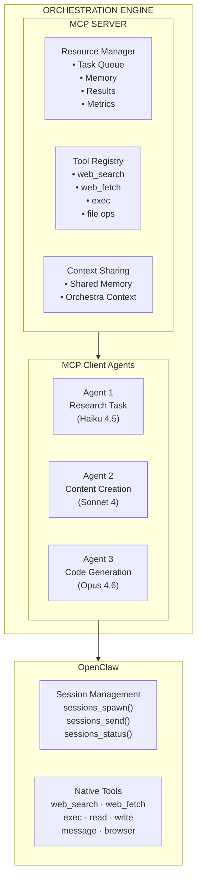

# MCP Integration

> ⚠️ **Status: DEFERRED** — MCP integration is planned for post-MVP (v1.0+). This document describes the intended design. No MCP code exists in the codebase. Related issues #24–27 are all deferred.

The orchestration engine integrates with the **Model Context Protocol (MCP)** to enable structured tool sharing, capability discovery, and coordinated context between sub-agents.

## MCP Architecture Overview



## MCP Server Implementation

### Core MCP Server

```python
from typing import Dict, List, Any, Optional, Callable
import json
import asyncio
from dataclasses import dataclass
from enum import Enum

class ResourceType(str, Enum):
    TASK_QUEUE = "task_queue"
    MEMORY_STORE = "memory_store"
    RESULT_CACHE = "result_cache"
    ORCHESTRA_CONTEXT = "orchestra_context"
    QUALITY_METRICS = "quality_metrics"

class ToolCapability(str, Enum):
    READ = "read"
    WRITE = "write"
    EXECUTE = "execute"
    SEARCH = "search"
    ANALYZE = "analyze"

@dataclass
class MCPResource:
    """MCP resource definition."""
    uri: str
    name: str
    description: str
    mimeType: str
    resource_type: ResourceType
    
@dataclass
class MCPTool:
    """MCP tool definition."""
    name: str
    description: str
    capabilities: List[ToolCapability]
    parameters: Dict[str, Any]  # JSON schema
    
class OrchestrationMCPServer:
    """MCP server for orchestration engine."""
    
    def __init__(self, orchestration_engine):
        self.engine = orchestration_engine
        self.resources: Dict[str, MCPResource] = {}
        self.tools: Dict[str, MCPTool] = {}
        self.clients: Dict[str, Dict[str, Any]] = {}  # client_id -> client_info
        
        # Register default resources and tools
        self._register_default_resources()
        self._register_default_tools()
        
    async def initialize(self, client_info: Dict[str, Any]) -> Dict[str, Any]:
        """Initialize MCP client connection."""
        client_id = client_info.get('clientId', f'client_{len(self.clients)}')
        
        self.clients[client_id] = {
            'info': client_info,
            'connected_at': datetime.now(),
            'last_heartbeat': datetime.now(),
            'capabilities': client_info.get('capabilities', [])
        }
        
        return {
            'protocolVersion': '2024-11-05',
            'capabilities': {
                'resources': {'subscribe': True, 'listChanged': True},
                'tools': {'listChanged': True},
                'prompts': {'listChanged': True},
                'logging': {}
            },
            'serverInfo': {
                'name': 'orchestration-engine-mcp',
                'version': '1.0.0'
            }
        }
        
    async def list_resources(self) -> List[Dict[str, Any]]:
        """List available resources."""
        return [
            {
                'uri': resource.uri,
                'name': resource.name,
                'description': resource.description,
                'mimeType': resource.mimeType
            }
            for resource in self.resources.values()
        ]
        
    async def read_resource(self, uri: str) -> Dict[str, Any]:
        """Read resource content."""
        resource = self.resources.get(uri)
        if not resource:
            raise ValueError(f"Resource not found: {uri}")
            
        if resource.resource_type == ResourceType.TASK_QUEUE:
            return await self._read_task_queue_resource(uri)
        elif resource.resource_type == ResourceType.MEMORY_STORE:
            return await self._read_memory_resource(uri)
        elif resource.resource_type == ResourceType.RESULT_CACHE:
            return await self._read_result_cache_resource(uri)
        elif resource.resource_type == ResourceType.ORCHESTRA_CONTEXT:
            return await self._read_orchestra_context_resource(uri)
        elif resource.resource_type == ResourceType.QUALITY_METRICS:
            return await self._read_quality_metrics_resource(uri)
        else:
            raise ValueError(f"Unknown resource type: {resource.resource_type}")
            
    async def list_tools(self) -> List[Dict[str, Any]]:
        """List available tools."""
        return [
            {
                'name': tool.name,
                'description': tool.description,
                'inputSchema': {
                    'type': 'object',
                    'properties': tool.parameters
                }
            }
            for tool in self.tools.values()
        ]
        
    async def call_tool(self, name: str, arguments: Dict[str, Any]) -> List[Dict[str, Any]]:
        """Execute tool with given arguments."""
        tool = self.tools.get(name)
        if not tool:
            raise ValueError(f"Tool not found: {name}")
            
        # Route to appropriate tool handler
        if name == 'submit_task':
            return await self._handle_submit_task(arguments)
        elif name == 'get_task_status':
            return await self._handle_get_task_status(arguments)
        elif name == 'query_memory':
            return await self._handle_query_memory(arguments)
        elif name == 'get_orchestra_context':
            return await self._handle_get_orchestra_context(arguments)
        elif name == 'update_shared_context':
            return await self._handle_update_shared_context(arguments)
        elif name == 'get_quality_metrics':
            return await self._handle_get_quality_metrics(arguments)
        else:
            raise ValueError(f"Unknown tool: {name}")
            
    def _register_default_resources(self):
        """Register default MCP resources."""
        self.resources.update({
            'queue://tasks/pending': MCPResource(
                uri='queue://tasks/pending',
                name='Pending Tasks',
                description='Currently queued tasks waiting for execution',
                mimeType='application/json',
                resource_type=ResourceType.TASK_QUEUE
            ),
            'queue://tasks/running': MCPResource(
                uri='queue://tasks/running',
                name='Running Tasks',
                description='Currently executing tasks',
                mimeType='application/json',
                resource_type=ResourceType.TASK_QUEUE
            ),
            'memory://episodic': MCPResource(
                uri='memory://episodic',
                name='Episodic Memory',
                description='Past task execution records',
                mimeType='application/json',
                resource_type=ResourceType.MEMORY_STORE
            ),
            'memory://semantic': MCPResource(
                uri='memory://semantic',
                name='Semantic Memory',
                description='Factual knowledge and relationships',
                mimeType='application/json',
                resource_type=ResourceType.MEMORY_STORE
            ),
            'memory://procedural': MCPResource(
                uri='memory://procedural',
                name='Procedural Memory',
                description='Learned patterns and strategies',
                mimeType='application/json',
                resource_type=ResourceType.MEMORY_STORE
            ),
            'context://orchestra/{orchestra_id}': MCPResource(
                uri='context://orchestra/{orchestra_id}',
                name='Orchestra Context',
                description='Shared context for orchestra workflow',
                mimeType='application/json',
                resource_type=ResourceType.ORCHESTRA_CONTEXT
            )
        })
        
    def _register_default_tools(self):
        """Register default MCP tools."""
        self.tools.update({
            'submit_task': MCPTool(
                name='submit_task',
                description='Submit a new task to the orchestration queue',
                capabilities=[ToolCapability.WRITE],
                parameters={
                    'task_type': {'type': 'string', 'enum': ['code', 'content', 'research', 'translation', 'review']},
                    'payload': {'type': 'object', 'description': 'Task-specific input data'},
                    'priority': {'type': 'integer', 'minimum': 1, 'maximum': 4, 'default': 3},
                    'orchestra_id': {'type': 'string', 'description': 'Parent orchestra ID (optional)'}
                }
            ),
            'get_task_status': MCPTool(
                name='get_task_status',
                description='Get status and result of a task',
                capabilities=[ToolCapability.READ],
                parameters={
                    'task_id': {'type': 'string', 'description': 'Task ID to check'}
                }
            ),
            'query_memory': MCPTool(
                name='query_memory',
                description='Query the orchestration memory system',
                capabilities=[ToolCapability.SEARCH],
                parameters={
                    'query': {'type': 'string', 'description': 'Natural language query'},
                    'memory_type': {'type': 'string', 'enum': ['episodic', 'semantic', 'procedural'], 'default': 'semantic'},
                    'limit': {'type': 'integer', 'minimum': 1, 'maximum': 50, 'default': 10}
                }
            ),
            'get_orchestra_context': MCPTool(
                name='get_orchestra_context',
                description='Get shared context for current orchestra',
                capabilities=[ToolCapability.READ],
                parameters={
                    'orchestra_id': {'type': 'string', 'description': 'Orchestra ID'},
                    'context_type': {'type': 'string', 'enum': ['all', 'results', 'progress', 'shared_data'], 'default': 'all'}
                }
            ),
            'update_shared_context': MCPTool(
                name='update_shared_context',
                description='Update shared context for orchestra agents',
                capabilities=[ToolCapability.WRITE],
                parameters={
                    'orchestra_id': {'type': 'string', 'description': 'Orchestra ID'},
                    'context_key': {'type': 'string', 'description': 'Context key to update'},
                    'context_value': {'description': 'Context value (any type)'},
                    'merge': {'type': 'boolean', 'default': True, 'description': 'Merge with existing context'}
                }
            ),
            'get_quality_metrics': MCPTool(
                name='get_quality_metrics',
                description='Get quality metrics for tasks or orchestras',
                capabilities=[ToolCapability.READ, ToolCapability.ANALYZE],
                parameters={
                    'entity_type': {'type': 'string', 'enum': ['task', 'orchestra', 'model'], 'default': 'task'},
                    'entity_id': {'type': 'string', 'description': 'Entity ID to get metrics for'},
                    'metric_types': {'type': 'array', 'items': {'type': 'string'}, 'description': 'Specific metrics to retrieve'}
                }
            )
        })
```

### Shared Context Management

```python
class SharedContextManager:
    """Manages shared context between orchestra agents."""
    
    def __init__(self, db_connection):
        self.db = db_connection
        self.context_cache: Dict[str, Dict[str, Any]] = {}
        
    async def get_orchestra_context(
        self, 
        orchestra_id: str, 
        context_type: str = 'all'
    ) -> Dict[str, Any]:
        """Get shared context for an orchestra."""
        # Check cache first
        if orchestra_id in self.context_cache:
            cached_context = self.context_cache[orchestra_id]
            if context_type == 'all':
                return cached_context
            else:
                return {context_type: cached_context.get(context_type, {})}
                
        # Load from database
        context_data = self.db.execute("""
            SELECT context_key, context_value, updated_at
            FROM orchestra_shared_context
            WHERE orchestra_id = ?
            ORDER BY updated_at DESC
        """, (orchestra_id,)).fetchall()
        
        context = {}
        for row in context_data:
            key = row['context_key']
            value = json.loads(row['context_value'])
            context[key] = value
            
        self.context_cache[orchestra_id] = context
        
        if context_type == 'all':
            return context
        else:
            return {context_type: context.get(context_type, {})}
            
    async def update_shared_context(
        self, 
        orchestra_id: str, 
        context_key: str, 
        context_value: Any, 
        merge: bool = True
    ):
        """Update shared context for an orchestra."""
        if merge and orchestra_id in self.context_cache:
            existing_value = self.context_cache[orchestra_id].get(context_key, {})
            if isinstance(existing_value, dict) and isinstance(context_value, dict):
                context_value = {**existing_value, **context_value}
                
        # Store in database
        self.db.execute("""
            INSERT OR REPLACE INTO orchestra_shared_context
            (orchestra_id, context_key, context_value, updated_at)
            VALUES (?, ?, ?, ?)
        """, (orchestra_id, context_key, json.dumps(context_value), datetime.now()))
        
        # Update cache
        if orchestra_id not in self.context_cache:
            self.context_cache[orchestra_id] = {}
        self.context_cache[orchestra_id][context_key] = context_value
        
        # Notify connected clients about context update
        await self._notify_context_update(orchestra_id, context_key, context_value)
        
    async def _notify_context_update(
        self, 
        orchestra_id: str, 
        context_key: str, 
        context_value: Any
    ):
        """Notify connected MCP clients about context updates."""
        notification = {
            'method': 'notifications/resources/updated',
            'params': {
                'uri': f'context://orchestra/{orchestra_id}',
                'context_key': context_key,
                'updated_at': datetime.now().isoformat()
            }
        }
        
        # Send to all connected clients working on this orchestra
        for client_id, client_info in self.mcp_server.clients.items():
            # Check if client is working on this orchestra
            if self._client_is_working_on_orchestra(client_id, orchestra_id):
                await self._send_notification(client_id, notification)
```

### Agent-to-Agent Communication

```python
class AgentCommunicationProtocol:
    """Enables direct communication between orchestra agents."""
    
    def __init__(self, mcp_server, context_manager):
        self.mcp_server = mcp_server
        self.context_manager = context_manager
        self.message_channels: Dict[str, List[str]] = {}  # orchestra_id -> [client_ids]
        
    async def register_agent_for_orchestra(self, client_id: str, orchestra_id: str):
        """Register an agent as working on a specific orchestra."""
        if orchestra_id not in self.message_channels:
            self.message_channels[orchestra_id] = []
            
        if client_id not in self.message_channels[orchestra_id]:
            self.message_channels[orchestra_id].append(client_id)
            
    async def send_message_to_agents(
        self, 
        orchestra_id: str, 
        message: Dict[str, Any], 
        exclude_sender: Optional[str] = None
    ):
        """Send a message to all agents in an orchestra."""
        if orchestra_id not in self.message_channels:
            return
            
        recipients = [
            client_id for client_id in self.message_channels[orchestra_id]
            if client_id != exclude_sender
        ]
        
        for client_id in recipients:
            await self._send_agent_message(client_id, message)
            
    async def send_direct_message(
        self, 
        from_client: str, 
        to_client: str, 
        message: Dict[str, Any]
    ):
        """Send a direct message between two agents."""
        wrapped_message = {
            'type': 'agent_message',
            'from': from_client,
            'to': to_client,
            'message': message,
            'timestamp': datetime.now().isoformat()
        }
        
        await self._send_agent_message(to_client, wrapped_message)
        
    async def _send_agent_message(self, client_id: str, message: Dict[str, Any]):
        """Send message to specific agent."""
        # This would implement the actual message sending mechanism
        # Could use WebSocket, HTTP push, or other protocols
        pass
```

### Tool Capability Discovery

```python
class CapabilityDiscovery:
    """Manages tool capability discovery between agents."""
    
    def __init__(self, mcp_server):
        self.mcp_server = mcp_server
        self.agent_capabilities: Dict[str, List[str]] = {}
        
    async def announce_capabilities(self, client_id: str, capabilities: List[str]):
        """Agent announces its capabilities."""
        self.agent_capabilities[client_id] = capabilities
        
        # Notify other agents about new capabilities
        await self._broadcast_capability_announcement(client_id, capabilities)
        
    async def discover_agents_with_capability(self, capability: str) -> List[str]:
        """Find agents that have a specific capability."""
        agents_with_capability = []
        
        for client_id, capabilities in self.agent_capabilities.items():
            if capability in capabilities:
                agents_with_capability.append(client_id)
                
        return agents_with_capability
        
    async def request_capability_execution(
        self, 
        requesting_client: str,
        capability: str, 
        parameters: Dict[str, Any]
    ) -> Dict[str, Any]:
        """Request another agent to execute a capability."""
        capable_agents = await self.discover_agents_with_capability(capability)
        
        if not capable_agents:
            raise ValueError(f"No agents found with capability: {capability}")
            
        # Select best agent (could be based on load, performance, etc.)
        selected_agent = capable_agents[0]  # Simple selection for now
        
        # Send capability execution request
        request = {
            'type': 'capability_request',
            'capability': capability,
            'parameters': parameters,
            'requesting_client': requesting_client,
            'request_id': f"req_{uuid4().hex[:12]}"
        }
        
        # This would implement async request/response
        response = await self._send_capability_request(selected_agent, request)
        return response
        
    async def _broadcast_capability_announcement(
        self, 
        announcing_client: str, 
        capabilities: List[str]
    ):
        """Broadcast capability announcement to other agents."""
        announcement = {
            'type': 'capability_announcement',
            'client': announcing_client,
            'capabilities': capabilities,
            'timestamp': datetime.now().isoformat()
        }
        
        for client_id in self.mcp_server.clients:
            if client_id != announcing_client:
                await self._send_agent_message(client_id, announcement)
```

### Authentication and Security

```python
class MCPAuthenticationManager:
    """Manages authentication and authorization for MCP clients."""
    
    def __init__(self, orchestration_engine):
        self.engine = orchestration_engine
        self.client_tokens: Dict[str, str] = {}  # client_id -> token
        self.token_permissions: Dict[str, List[str]] = {}  # token -> permissions
        
    def generate_session_token(self, client_id: str, permissions: List[str]) -> str:
        """Generate a session token for an MCP client."""
        token = f"mcp_token_{uuid4().hex}"
        self.client_tokens[client_id] = token
        self.token_permissions[token] = permissions
        return token
        
    def validate_client_access(self, client_id: str, resource_uri: str) -> bool:
        """Validate client access to a resource."""
        token = self.client_tokens.get(client_id)
        if not token:
            return False
            
        permissions = self.token_permissions.get(token, [])
        
        # Check permissions based on resource URI
        if resource_uri.startswith('queue://'):
            return 'queue_access' in permissions
        elif resource_uri.startswith('memory://'):
            return 'memory_access' in permissions
        elif resource_uri.startswith('context://'):
            return 'context_access' in permissions
        else:
            return 'full_access' in permissions
            
    def get_client_permissions(self, client_id: str) -> List[str]:
        """Get permissions for a client."""
        token = self.client_tokens.get(client_id)
        if not token:
            return []
        return self.token_permissions.get(token, [])
```

## MCP Client Integration

### Agent MCP Client

```python
class OrchestrationMCPClient:
    """MCP client for orchestra agents."""
    
    def __init__(self, server_url: str, agent_id: str):
        self.server_url = server_url
        self.agent_id = agent_id
        self.session_token = None
        self.capabilities = []
        
    async def connect(self, capabilities: List[str]):
        """Connect to the MCP server."""
        self.capabilities = capabilities
        
        init_request = {
            'clientId': self.agent_id,
            'capabilities': capabilities,
            'agentInfo': {
                'name': f'Orchestra Agent {self.agent_id}',
                'version': '1.0.0'
            }
        }
        
        response = await self._send_request('initialize', init_request)
        self.session_token = response.get('sessionToken')
        
        return response
        
    async def submit_subtask(
        self, 
        task_type: str, 
        payload: Dict[str, Any], 
        orchestra_id: str
    ) -> str:
        """Submit a subtask to the orchestration engine."""
        return await self._call_tool('submit_task', {
            'task_type': task_type,
            'payload': payload,
            'orchestra_id': orchestra_id,
            'priority': 2  # Higher priority for sub-tasks
        })
        
    async def get_shared_context(self, orchestra_id: str, context_type: str = 'all'):
        """Get shared context from the orchestra."""
        return await self._call_tool('get_orchestra_context', {
            'orchestra_id': orchestra_id,
            'context_type': context_type
        })
        
    async def update_shared_context(
        self, 
        orchestra_id: str, 
        context_key: str, 
        context_value: Any
    ):
        """Update shared context for other agents."""
        return await self._call_tool('update_shared_context', {
            'orchestra_id': orchestra_id,
            'context_key': context_key,
            'context_value': context_value
        })
        
    async def query_memory(self, query: str, memory_type: str = 'semantic'):
        """Query the orchestration memory system."""
        return await self._call_tool('query_memory', {
            'query': query,
            'memory_type': memory_type
        })
        
    async def _call_tool(self, tool_name: str, arguments: Dict[str, Any]):
        """Call a tool on the MCP server."""
        request = {
            'method': 'tools/call',
            'params': {
                'name': tool_name,
                'arguments': arguments
            }
        }
        
        response = await self._send_request('tools/call', request)
        return response.get('content', [])
        
    async def _send_request(self, method: str, params: Dict[str, Any]) -> Dict[str, Any]:
        """Send request to MCP server."""
        # This would implement the actual HTTP/WebSocket communication
        pass
```

## Usage Examples

### Orchestra Agent with MCP

```python
class OrchestrationAwareAgent:
    """Agent that integrates with orchestration MCP server."""
    
    def __init__(self, agent_id: str, mcp_server_url: str):
        self.agent_id = agent_id
        self.mcp_client = OrchestrationMCPClient(mcp_server_url, agent_id)
        self.orchestra_id = None
        
    async def initialize(self, orchestra_id: str):
        """Initialize agent for orchestra participation."""
        self.orchestra_id = orchestra_id
        
        # Connect to MCP server with capabilities
        capabilities = ['code_generation', 'web_search', 'content_creation']
        await self.mcp_client.connect(capabilities)
        
        # Get orchestra context
        context = await self.mcp_client.get_shared_context(orchestra_id)
        return context
        
    async def execute_task_with_context(self, task: Dict[str, Any]):
        """Execute task with access to shared context and memory."""
        # Query relevant memory
        memory_results = await self.mcp_client.query_memory(
            query=task.get('description', ''),
            memory_type='procedural'
        )
        
        # Get current orchestra context
        shared_context = await self.mcp_client.get_shared_context(self.orchestra_id)
        
        # Execute task with enhanced context
        result = await self._execute_with_enhanced_context(
            task, memory_results, shared_context
        )
        
        # Update shared context with results
        await self.mcp_client.update_shared_context(
            self.orchestra_id,
            f'task_{task["id"]}_result',
            result
        )
        
        return result
        
    async def collaborate_with_other_agents(self, capability_needed: str, params: Dict[str, Any]):
        """Request capability execution from other agents."""
        # This would use the capability discovery system
        result = await self.mcp_client.request_capability_execution(
            capability_needed, params
        )
        return result
```

### MCP Server Database Schema

```sql
-- Orchestra shared context
CREATE TABLE orchestra_shared_context (
    orchestra_id TEXT NOT NULL,
    context_key TEXT NOT NULL,
    context_value TEXT NOT NULL,  -- JSON
    updated_at TIMESTAMP DEFAULT CURRENT_TIMESTAMP,
    updated_by_client TEXT,
    PRIMARY KEY (orchestra_id, context_key)
);

-- MCP client sessions
CREATE TABLE mcp_client_sessions (
    client_id TEXT PRIMARY KEY,
    session_token TEXT NOT NULL,
    capabilities TEXT NOT NULL,  -- JSON array
    permissions TEXT NOT NULL,   -- JSON array
    connected_at TIMESTAMP DEFAULT CURRENT_TIMESTAMP,
    last_heartbeat TIMESTAMP DEFAULT CURRENT_TIMESTAMP,
    orchestra_id TEXT,
    status TEXT DEFAULT 'active'
);

-- Agent capability registry
CREATE TABLE agent_capabilities (
    client_id TEXT NOT NULL,
    capability TEXT NOT NULL,
    confidence REAL DEFAULT 1.0,
    last_used TIMESTAMP,
    usage_count INTEGER DEFAULT 0,
    success_rate REAL DEFAULT 1.0,
    PRIMARY KEY (client_id, capability)
);

-- Inter-agent messages
CREATE TABLE agent_messages (
    message_id TEXT PRIMARY KEY,
    from_client TEXT NOT NULL,
    to_client TEXT,  -- NULL for broadcast
    orchestra_id TEXT,
    message_type TEXT NOT NULL,
    content TEXT NOT NULL,  -- JSON
    sent_at TIMESTAMP DEFAULT CURRENT_TIMESTAMP,
    delivered_at TIMESTAMP,
    status TEXT DEFAULT 'pending'
);
```

MCP integration enables **seamless coordination, shared context, and capability sharing** between orchestra agents, making complex multi-agent workflows more efficient and intelligent.