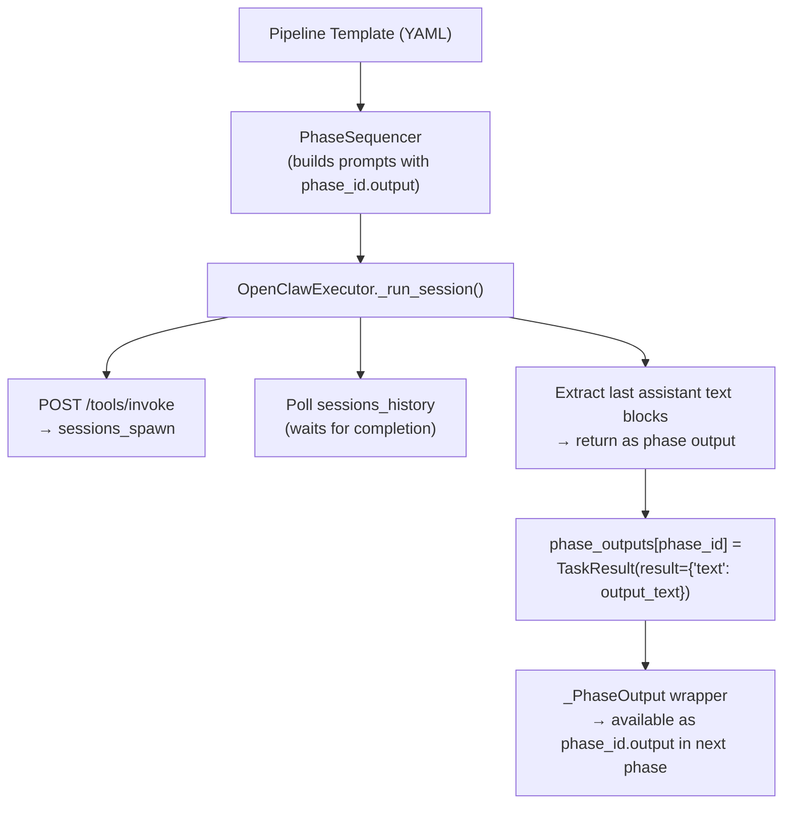

> ⚠️ **HISTORICAL DOCUMENT** — Written February 2026. Many issues described here have since been addressed. See current documentation for up-to-date information.

# Architectural Review: OpenClaw Executor Output Extraction

**Date:** 2026-02-24  
**Author:** Toscan (analysis) + Opus 4.6 (codebase review)  
**Issue:** #136 — Sub-agents produce work via tools, but orchestrator only captures conversational text

---

## Problem Statement

The OpenClaw executor spawns sub-agents that have full tool access (file read/write, exec, web search). When these agents do real work — reading files, writing code, running tests — this happens through tool calls. The orchestrator only extracts the last assistant text message, which is often conversational ("Let me read the files...") rather than the substantive output.

**Result:** Multi-phase pipelines fail to chain properly. Phase 2 never sees Phase 1's actual work.

## Current Architecture



**The gap:** `sessions_history` returns the full conversation including tool calls, but the executor only reads `content[].type == "text"` from the last assistant message.

## Approaches Analyzed

### Approach A: Prompt-Constrained Output (Text-Only Agents)

**How:** Add explicit instructions to each phase prompt: "Output ALL results directly in your response text. Do NOT use file tools."

**Pros:**
- Simplest to implement (prompt change only)
- Works immediately with current executor
- Agents produce predictable, parseable output
- Matches standalone mode behavior (Anthropic API agents have no tools)

**Cons:**
- **Severely limits agent capability** — can't read existing code, run tests, verify builds
- Requirements analysis becomes guesswork without file access
- Code review can't actually read the code under review
- Defeats the purpose of using OpenClaw (which gives agents tools)

**Verdict:** ❌ Unacceptable. This makes the orchestrator a worse version of standalone mode.

### Approach B: Full Transcript Extraction

**How:** Use `sessions_history(includeTools=true)` and extract ALL text from the entire conversation — tool results, thinking, assistant text — concatenated.

**Pros:**
- Captures everything the agent saw and produced
- No changes to how agents work

**Cons:**
- Massive output (tool results include full file contents)
- Noisy — includes exploration text, error recovery, internal reasoning
- Subsequent phases would receive 50KB+ of raw transcript
- Impossible to parse structured output from the noise

**Verdict:** ❌ Too noisy. Would break template variable interpolation with massive context.

### Approach C: Summary Request Pattern

**How:** After a sub-agent completes, send a follow-up message via `sessions_send`: "Summarize your complete output. Include all code, analysis, and findings in your response."

**Pros:**
- Agent has full context of its own work
- Agent can produce a clean, structured summary
- Leverages the agent's understanding of what's important
- Works for any type of phase (code, analysis, review)

**Cons:**
- Requires a second turn per phase (adds latency + tokens)
- `sessions_send` may not work for completed sessions
- Agent might hallucinate or omit details in summary

**Verdict:** ⚠️ Promising but needs investigation. Does `sessions_send` work on completed sub-agent sessions?

### Approach D: File-Based Output Convention

**How:** Each phase prompt instructs the agent to write its output to a known file path: `/tmp/orch/{run_id}/{phase_id}/output.md`. The orchestrator reads this file after the session completes.

**Pros:**
- Clean separation: agents work naturally, output goes to a specific file
- Orchestrator reads a single file per phase
- Agents can still use all tools freely
- Output format is predictable and structured

**Cons:**
- Requires consistent prompt instructions per phase
- Agent might forget to write the file (need validation)
- Filesystem dependency (agents must have write access to the path)
- Cleanup needed after pipeline completion

**Verdict:** ✅ **Strong candidate.** Simple, reliable, works with full tool access.

### Approach E: Hybrid — Structured Prompt + Last-Message Extraction

**How:** Phase prompts explicitly say: "After completing your work, write a FINAL SUMMARY section at the end of your response that contains all deliverables." The executor then extracts text after a known marker.

**Pros:**
- Agents work naturally with full tools
- Final message contains structured output
- No filesystem dependency
- Backward compatible with current executor

**Cons:**
- Relies on agents following the instruction (they sometimes don't)
- Need a reliable marker/delimiter
- May need prompt engineering per phase type

**Verdict:** ✅ **Strong candidate.** Works if agents reliably produce final summaries.

### Approach F: Two-Phase Execution (Work + Report)

**How:** The orchestrator spawns each pipeline phase as TWO sub-agents:
1. **Worker:** Full tool access, does the actual work, writes results to workspace
2. **Reporter:** Reads the worker's output files, produces clean structured summary for the pipeline

**Pros:**
- Clean separation of concerns
- Worker focuses on quality, reporter focuses on formatting
- Pipeline always gets clean, structured output

**Cons:**
- Doubles the number of sub-agents (cost + latency)
- Complex orchestration logic
- Overkill for simple analysis phases

**Verdict:** ⚠️ Elegant but expensive. Reserve for future optimization.

## Recommended Strategy: Approach D + E Hybrid

**Combine file-based output with structured prompt instructions:**

1. **Every phase prompt gets a standard preamble:**
   ```
   ## Output Instructions
   When you complete your work, write your final deliverable to:
   /tmp/orch/{run_id}/{phase_id}/output.md
   
   Also include a ## DELIVERABLE section at the end of your response
   with the key output that downstream phases need.
   ```

2. **Executor extraction priority:**
   - First: Try reading `/tmp/orch/{run_id}/{phase_id}/output.md`
   - Fallback: Extract text after `## DELIVERABLE` marker from last assistant message
   - Last resort: Use full last assistant text (current behavior)

3. **Template-level control:** Add an `output_strategy` field to phase definitions:
   ```yaml
   phases:
     - id: implement
       output_strategy: file  # or "text" or "auto"
       output_path: "output.md"  # relative to phase workspace
   ```

### Implementation Plan

**Issue 1: Output extraction strategies** (M)
- Add `OutputStrategy` enum: `file`, `text`, `marker`, `auto`
- Add `output_strategy` and `output_path` to `PhaseDefinition` schema
- Update `OpenClawExecutor._run_session()` to return based on strategy
- Default: `auto` (try file → marker → text)

**Issue 2: Phase workspace directories** (S)
- Create `/tmp/orch/{run_id}/{phase_id}/` before spawning each phase
- Pass workspace path as template variable `{phase_workspace}`
- Cleanup on pipeline completion (or keep for debugging)

**Issue 3: Prompt preamble injection** (S)
- Add configurable preamble to phase prompts in `PhaseSequencer._build_phase_input()`
- Include output instructions + workspace path
- Template can override with `output_instructions: custom text`

**Issue 4: File-based output reader** (S)
- After session completes, read `{phase_workspace}/output.md`
- Validate it exists and has content
- Fallback chain: file → marker → text

**Issue 5: Update code-development-pipeline template** (S)
- Add output_strategy to each phase
- Update prompts with output instructions
- Test full pipeline E2E

### Risks & Mitigations

| Risk | Mitigation |
|------|-----------|
| Agent ignores output instructions | Fallback chain ensures we always get something |
| File path collision between runs | UUID-based run_id prevents this |
| Agent writes to wrong path | Validate path in prompt, include as template variable |
| Large output files | Cap at 100KB per phase, truncate with warning |
| Cleanup of temp files | Optional `--keep-workspace` flag, default cleanup |

### Estimated Effort

- 5 issues, all S-M size
- ~2-3 hours of implementation
- ~1 hour of testing
- 1 pipeline E2E validation run

### Future Enhancements

- **Approach C (summary request)**: Add as optional strategy once `sessions_send` for completed sessions is confirmed working
- **Approach F (two-phase)**: Add as `output_strategy: reviewed` for high-stakes phases
- **Streaming output**: SSE progress events include partial output as agent writes
