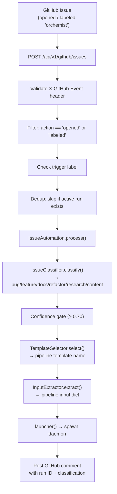
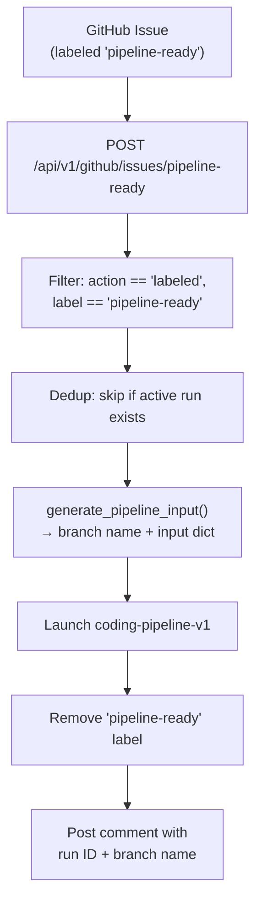

# Issue Automation

> **Modules**: `orchestration_engine.issue_automation` (~1 640 lines),
> `orchestration_engine.webhooks` (~327 lines),
> `orchestration_engine.github_fetcher` (~314 lines),
> `orchestration_engine.sprint_chain` (~502 lines)
> **Issues**: #5.1.1 (classification), #5.1.4 (result posting), #507 (GitHub fetcher), #511 (pipeline-ready label), #514 (sprint chain)
> **Status**: Fully implemented — classification, template selection, input extraction, launch, label triggers, sprint queue, result delivery

The issue automation system converts GitHub issues into running pipeline
instances without human intervention. When an issue is opened (or labeled),
a webhook triggers an LLM-based classification, selects the appropriate
pipeline template, extracts input parameters from the issue body, and
spawns a daemon subprocess — all in a single HTTP request cycle.

---

## Table of Contents

1. [Architecture Overview](#architecture-overview)
2. [Webhook Endpoints](#webhook-endpoints)
3. [Issue Classification](#issue-classification)
4. [Template Selection](#template-selection)
5. [Input Extraction](#input-extraction)
6. [IssueAutomation Orchestrator](#issueautomation-orchestrator)
7. [GitHub Fetcher](#github-fetcher)
8. [Pipeline-Ready Label Trigger](#pipeline-ready-label-trigger)
9. [GitHub Helpers](#github-helpers)
10. [Sprint Chain Automation](#sprint-chain-automation)
11. [Webhook Triggers (Generic)](#webhook-triggers-generic)
12. [Database Schema](#database-schema)
13. [Result Delivery](#result-delivery)
14. [Design Decisions](#design-decisions)

---

## Architecture Overview



A second, simpler path exists for the `pipeline-ready` label:



---

## Webhook Endpoints

### `POST /api/v1/github/issues`

Full LLM-classification path. Handles both `opened` and `labeled` actions.

| Step | Action |
|------|--------|
| 1 | Validate `X-GitHub-Event: issues` — ignore other event types |
| 2 | Filter for `action == "opened"` or `action == "labeled"` |
| 3 | Check trigger label (env `ISSUE_TRIGGER_LABEL`, default `"orchemist"`) |
| 4 | HMAC signature verification (opt-in via `webhook_secret` config) |
| 5 | Deduplication via `db.get_active_issue_run(issue_number, repo)` |
| 6 | Build `IssueAutomation` and call `process()` |
| 7 | Post GitHub comment (best-effort) |

**Responses**: `200` (ignored/skipped/dedup), `202` (launched), `400` (bad payload), `403` (bad signature).

### `POST /api/v1/github/issues/pipeline-ready`

Simplified fast-path — no LLM classification, always launches `coding-pipeline-v1`.

| Step | Action |
|------|--------|
| 1 | Validate `X-GitHub-Event: issues` |
| 2 | Filter: `action == "labeled"`, `label.name == "pipeline-ready"` |
| 3 | Deduplication |
| 4 | `generate_pipeline_input()` → deterministic branch name |
| 5 | Resolve + load `coding-pipeline-v1` template |
| 6 | Launch daemon |
| 7 | Remove `pipeline-ready` label |
| 8 | Post comment |

**Responses**: `200` (ignored/skipped), `202` (launched), `400` (bad payload/template).

---

## Issue Classification

**Class**: `issue_automation.IssueClassifier`

Uses Claude Haiku to classify a GitHub issue into one of six categories.

### Categories

| Type | Description | Default Template |
|------|-------------|-----------------|
| `bug` | Defects, errors, crashes, unexpected behaviour | `coding-pipeline-v1` |
| `feature` | New functionality, enhancements | `coding-pipeline-v1` |
| `docs` | Documentation-only changes | `content-pipeline-v27` |
| `refactor` | Code quality, restructuring, no behaviour change | `coding-pipeline-v1` |
| `research` | Investigation, spike, feasibility study | `research-competitive` |
| `content` | Blog posts, articles, marketing copy | `content-pipeline-v27` |

### Prompt

```
You are an expert software project manager. Classify the following GitHub issue
into exactly one category.

## Categories
- bug: defect, error, crash, unexpected behaviour, wrong output
- feature: new functionality, enhancement, new capability
- docs: documentation-only change (README, docstring, wiki, etc.)
- refactor: code quality, cleanup, restructuring — no behaviour change
- research: investigation, spike, feasibility study, benchmarking
- content: blog post, article, marketing copy, non-code writing

## Issue
Title: {title}
Labels: {labels}
Body:
{body}                    ← truncated to 3 000 chars

## Instructions
Respond with a single JSON object on ONE line.
Required: "classification_type", "confidence" (0.0–1.0), "reasoning" (≤120 chars)
```

### Parse Strategy

1. Direct JSON parse of full response.
2. Fallback: regex search for first `{...}` block (handles LLMs that prepend prose).
3. Fallback: return `("feature", 0.0, "Parse error")`.

Unknown `classification_type` values are normalised to `"feature"`.
Confidence is clamped to `[0.0, 1.0]`.

### Stub Mode

When `executor=None`, the classifier operates in stub mode — returns
`"feature"` with `confidence=0.0`. Useful for offline tests and dry runs.

---

## Template Selection

**Class**: `issue_automation.TemplateSelector`

Maps classification types to pipeline template names.

### Default Mapping

| Classification | Template (abstract) | Template (concrete) |
|---------------|--------------------|--------------------|
| `bug` | `coding-pipeline` | `coding-pipeline-v1` |
| `feature` | `coding-pipeline` | `coding-pipeline-v1` |
| `refactor` | `coding-pipeline` | `coding-pipeline-v1` |
| `docs` | `content-pipeline` | `content-pipeline-v27` |
| `content` | `content-pipeline` | `content-pipeline-v27` |
| `research` | `research-pipeline` | `research-competitive` |

Supports custom mapping injection and a configurable fallback template
(default: `"coding-pipeline"`).

---

## Input Extraction

**Class**: `issue_automation.InputExtractor`

Uses LLM-assisted extraction to map a GitHub issue to a pipeline input dict.

### Flow

1. Read template's `config_schema` (from YAML `config_schema:` block).
2. Build prompt with schema + issue title + body (truncated to 3 000 chars).
3. Call Haiku executor.
4. Parse JSON response → dict whose keys match schema fields.
5. Return empty dict on failure (stub mode or parse error).

### Prompt

```
You are a pipeline configuration assistant. Given a GitHub issue and a pipeline
config schema, extract the values needed to launch the pipeline.

## Pipeline Config Schema
{schema}                  ← JSON-formatted schema dict

## GitHub Issue
Title: {title}
Body: {body}

## Instructions
Return a single JSON object whose keys match the schema fields above.
```

---

## IssueAutomation Orchestrator

**Class**: `issue_automation.IssueAutomation`

Chains the four steps into a single `process()` call.

### Constructor

```python
automation = IssueAutomation(
    classifier=IssueClassifier(executor=my_executor),
    selector=TemplateSelector(),
    extractor=InputExtractor(executor=my_executor),
    confidence_threshold=0.70,
    notification_dispatcher=NotificationDispatcher.from_env(),
)
```

### `process()` Flow

1. **Classify** → `IssueClassifier.classify()` → persists to `issue_pipeline_map` table.
2. **Confidence gate** — if `confidence < threshold`:
   - Dispatch `human_review` notification via Telegram.
   - Set status to `"escalated"` in DB.
   - Return without launching.
3. **Select template** → `TemplateSelector.select()`.
4. **Extract inputs** → `InputExtractor.extract()` using template's config schema.
   Always injects `issue_number` and `repo` as fallback defaults.
5. **Launch** → call `launcher()` (typically `_launch_pipeline_from_trigger`).
   On success, updates classification status to `"launched"`.

### Return Dict

```python
{
    "issue_number": 42,
    "repo": "owner/repo",
    "classification_type": "bug",
    "confidence": 0.92,
    "template": "coding-pipeline",
    "run_id": "abc-123",       # None if not launched
    "comment_body": "🤖 Orchemist has picked up this issue...",
    "escalated": False,
}
```

### Comment Format

```markdown
🤖 **Orchemist** has picked up this issue.

**Classification:** `bug` (confidence: 92%)
**Pipeline:** `coding-pipeline`
**Run ID:** `abc-123`
**Reasoning:** Issue describes a crash when input is null.
```

Escalated issues get a different comment noting low confidence and Telegram escalation.

---

## GitHub Fetcher

**Module**: `orchestration_engine.github_fetcher` (Issue #507)

Fetches issue data via `gh api` for `orch launch --issue <number>`.

### GitHubIssueData

```python
@dataclass
class GitHubIssueData:
    issue_number: int
    title:        str
    body:         str
    labels:       List[str]
    assignees:    List[str]
    milestone:    Optional[str]
    state:        str          # "open" or "closed"
    html_url:     str
    repo:         str
```

### Merge Strategy

- **Canonical fields** (`issue_number`, `title`, `body`, `labels`, `assignees`,
  `milestone`) → always override user-supplied input.
- **All other fields** → fill missing keys only (user's explicit `--input` takes precedence).

### Usage

```python
data = fetch_github_issue(repo="owner/repo", issue_number=507)
if data:
    initial_input = data.merge_into(initial_input)
```

---

## Pipeline-Ready Label Trigger

**Endpoint**: `POST /api/v1/github/issues/pipeline-ready` (Issue #511)

A streamlined trigger: when someone applies the `pipeline-ready` label to a
GitHub issue, the engine immediately launches `coding-pipeline-v1` with a
deterministic branch name.

### Branch Name Generation

`slugify_branch(title)` → `"feat/{issue_number}-{slug}"`:

- Unicode normalised to ASCII (NFKD decomposition).
- Lowercased, non-alphanumeric → hyphens.
- Truncated to 40 characters.
- Example: `"Fix null pointer in pipeline runner"` → `"feat/42-fix-null-pointer-in-pipeline-runner"`.

### Pipeline Input

```python
{
    "issue_number": 42,
    "repo": "owner/repo",
    "title": "Fix null pointer...",
    "body": "When the pipeline runner receives...",
    "branch_name": "feat/42-fix-null-pointer-in-pipeline-runner",
    # optional: "repo_path": "/path/to/repo"
}
```

### Post-Launch Actions

1. **Remove label** — `remove_github_label(repo, issue_number, "pipeline-ready")`
   prevents re-triggering.
2. **Post comment** — with branch name and run ID for traceability.

---

## GitHub Helpers

All helpers use the `gh` CLI (GitHub CLI) with a 15-second timeout.
Failures are logged as warnings and return `None`/`False` — never raised.

| Function | Description |
|----------|-------------|
| `post_github_comment(repo, issue, body)` | POST a Markdown comment; returns HTML URL |
| `remove_github_label(repo, issue, label)` | DELETE a label (URL-encoded); returns bool |
| `add_github_label(repo, issue, label)` | POST a label; returns bool |
| `get_github_issue_labels(repo, issue)` | GET label names list |
| `create_pr_for_issue(repo, issue, branch, title, body)` | `gh pr create` with `Closes #N`; returns PR URL |
| `post_pipeline_result_comment(repo, issue, type, text, run_id)` | Post formatted pipeline output as comment |
| `post_failure_summary_comment(repo, issue, error, run_id, diagnosis)` | Post failure summary with optional diagnosis |

---

## Sprint Chain Automation

**Module**: `orchestration_engine.sprint_chain` (Issue #514)

After a successful auto-merge, the sprint chain manager advances the queue
to the next issue.

### Sprint Queue Config

```yaml
# sprint_queue.yaml
repo: owner/repo
issues: [101, 102, 103, 104, 105]
score_threshold: 0.75           # minimum confidence to advance
daily_budget_cap_usd: 5.00     # optional daily spend limit
comment_template: >
  Queued by sprint runner — previous issue #{previous_issue} merged successfully
```

### SprintChainManager.trigger_next()

9-step orchestration:

| Step | Action | Guard? |
|------|--------|--------|
| 1 | Load `sprint_queue.yaml` | Config parse errors halt chain |
| 2 | **Score guard** — `score >= score_threshold` | Yes |
| 3 | Query DB for already-processed issues | |
| 4 | Find next unprocessed issue in queue | Exhausted → stop |
| 5 | **Budget guard** — daily cost < `daily_budget_cap_usd` | Yes |
| 6 | **Human-pause guard** — `sprint_chain_state.status != 'paused'` | Yes |
| 7 | Mark current issue as `"processed"` in DB | |
| 8 | Apply `pipeline-ready` label to next issue | Failure → stop |
| 9 | Post queue-advancement comment (non-fatal) | |

### Guard Rails

| Guard | Condition to Advance | Halt Reason |
|-------|---------------------|-------------|
| **Score** | `score >= score_threshold` (default 0.75) | `score_below_threshold` |
| **Budget** | `daily_cost < daily_budget_cap_usd` | `daily_budget_cap_reached` |
| **Human pause** | No `status='paused'` row for next issue | `human_paused` |

### Daemon Integration

Called from `_dispatch_auto_merge()` in `daemon.py` after a successful merge.
Enabled when the `ORCH_SPRINT_QUEUE_CONFIG` environment variable is set to the
path of the sprint queue YAML file. Non-fatal — all errors are caught.

### TriggerResult

```python
@dataclass
class TriggerResult:
    triggered:   bool              # True when next issue was labeled
    next_issue:  Optional[int]     # issue number, or None
    reason:      str               # "ok", "queue_exhausted", "score_below_threshold", ...
    comment_url: Optional[str]     # GitHub comment URL, or None
```

---

## Webhook Triggers (Generic)

**Module**: `orchestration_engine.webhooks`

A general-purpose webhook trigger system (separate from the GitHub-specific
issue endpoints).

### TriggerConfig

```python
@dataclass
class TriggerConfig:
    id:          str                # 3-64 chars, alphanumeric + hyphens
    template_id: str                # pipeline template to run
    mode:        str                # "sync", "async", "fire_and_forget"
    secret:      Optional[str]      # HMAC-SHA256 shared secret
    rate_limit:  int                # requests/minute (0 = unlimited)
    input_map:   Dict[str, Any]     # payload → pipeline input mapping
    filters:     List[Dict]         # AND-combined filter conditions
    enabled:     bool               # master switch
```

### TriggerMatcher

Evaluates filter conditions against incoming payloads (AND logic):

| Filter Key | Matches Against |
|------------|----------------|
| `branch` | `payload["ref"]` (strips `refs/heads/` prefix) |
| `labels` | Any label name in payload (single or list) |
| `action` | Exact match on `payload["action"]` |
| `event_type` | Exact match on `payload["event_type"]` |

Unknown filter keys emit a warning but do not fail the match.

### InputMapper

Resolves `{{payload.x.y}}` template strings from webhook payloads:

```python
input_map = {"repo": "{{payload.repository.full_name}}", "env": "prod"}
# → {"repo": "org/repo", "env": "prod"}
```

- Bare `{{payload}}` returns the entire payload dict.
- Unresolvable paths yield `None`.

### Webhook Registration Script

`scripts/register_webhook.py` — one-shot idempotent setup:

1. Generate a 64-char hex HMAC secret and store at `~/.orchestration-engine/webhook-secret` (mode 0600).
2. Register a `check_suite.completed` webhook on GitHub via `gh api`.
3. Create a matching trigger row in the engine DB.

---

## Database Schema

### `issue_pipeline_map` table (Issue #5.1.1)

| Column | Type | Description |
|--------|------|-------------|
| `id` | `INTEGER PK` | Auto-increment |
| `issue_number` | `INTEGER NOT NULL` | GitHub issue number |
| `repo` | `TEXT NOT NULL` | Repository slug |
| `classification_type` | `TEXT NOT NULL` | One of the 6 category values |
| `confidence` | `REAL NOT NULL` | LLM confidence [0.0, 1.0] |
| `template_id` | `TEXT` | Selected pipeline template |
| `run_id` | `TEXT` | Linked pipeline run (set after launch) |
| `status` | `TEXT NOT NULL` | `classified` → `launched` / `escalated` / `skipped` |
| `created_at` | `TIMESTAMP` | Default `CURRENT_TIMESTAMP` |

**Indexes**:
- `idx_issue_pipeline_map_issue_repo ON (issue_number, repo)`
- `idx_issue_pipeline_map_repo_created ON (repo, created_at)`

### Query Methods

| Method | Description |
|--------|-------------|
| `insert_issue_classification(data)` | Insert a new classification row, return PK |
| `get_issue_classification(issue_number, repo)` | Most recent classification (ORDER BY id DESC) |
| `get_issue_classification_by_run_id(run_id)` | Resolve run → triggering issue |
| `get_issue_pipeline_map_by_run_id(run_id)` | Public alias of above (spec-mandated name) |
| `list_issue_classifications(repo?, limit)` | Paginated list, newest first |
| `update_issue_classification_status(row_id, status)` | Update lifecycle status |
| `get_active_issue_run(issue_number, repo)` | Dedup check: find non-terminal linked run |

### Deduplication Query

`get_active_issue_run` joins `issue_pipeline_map` with `pipeline_runs` to
find rows where the linked run's status is NOT in `TERMINAL_STATUSES`.
Rows with `run_id IS NULL` are excluded (classified but not yet launched).

---

## Result Delivery

After a pipeline completes (success or failure), the daemon's
`_post_github_result_hook` resolves the triggering issue via
`get_issue_classification_by_run_id(run_id)` and posts results back:

### Code Pipelines (bug / feature / refactor)

Creates a pull request via `create_pr_for_issue()` with `Closes #N` in the
body, so GitHub auto-links and auto-closes the issue on merge.

### Non-Code Pipelines (content / docs / research)

Posts the pipeline output directly as an issue comment via
`post_pipeline_result_comment()`.

### Failed Pipelines

Posts a failure summary comment via `post_failure_summary_comment()` including:
- Error message
- Diagnosis fields (when available): `failure_class`, `remediation`, `confidence`
- Run ID for traceability

---

## Design Decisions

| Decision | Rationale |
|----------|-----------|
| **Haiku for classification** | Fast (~1s) and cheap (~$0.05). Classification accuracy is sufficient for structured JSON output with 6 categories. |
| **Confidence threshold (0.70)** | Below this, the LLM's category assignment is too uncertain for automatic template selection. Escalation to human review via Telegram is safer. |
| **Two separate endpoints** | `/github/issues` does full LLM classification (any issue type). `/github/issues/pipeline-ready` is a fast-path that skips classification (always coding-pipeline-v1). Different use cases, different tradeoffs. |
| **Dedup via `get_active_issue_run`** | Prevents launching duplicate pipelines when labels are toggled or webhooks are retried. Checks `pipeline_runs.status NOT IN terminal_statuses`. |
| **Label removal after launch** | Removing `pipeline-ready` prevents re-triggering if the webhook fires again. The label is the signal, not a persistent state. |
| **Deterministic branch names** | `feat/{issue}-{slug}` is predictable, grep-friendly, and linked to the issue. `slugify_branch()` handles Unicode, special chars, and length. |
| **Non-fatal GitHub API calls** | All `gh` CLI calls use timeout=15s, check=False. Failures are logged as warnings. A broken GitHub API should never abort a pipeline or crash the daemon. |
| **Sprint chain guard rails** | Score guard, budget guard, and human-pause guard prevent runaway chains. Any guard failure halts advancement cleanly with a descriptive reason. |
| **Config-driven sprint queue** | The YAML file is the single source of truth for issue ordering, thresholds, and budget caps. Human override via DB `status='paused'` row. |
| **Stub mode** | Both `IssueClassifier` and `InputExtractor` accept `executor=None` for offline tests and dry runs — no LLM dependency required. |

---

*Source files*:
`src/orchestration_engine/issue_automation.py` (IssueClassifier, TemplateSelector, InputExtractor, IssueAutomation, GitHub helpers),
`src/orchestration_engine/webhooks.py` (TriggerConfig, TriggerMatcher, InputMapper),
`src/orchestration_engine/github_fetcher.py` (GitHubIssueFetcher, GitHubIssueData),
`src/orchestration_engine/sprint_chain.py` (SprintChainManager, SprintQueueConfig),
`src/orchestration_engine/web/api.py` (webhook endpoints),
`src/orchestration_engine/db.py` (issue_pipeline_map table + queries),
`scripts/register_webhook.py` (one-shot webhook setup)
