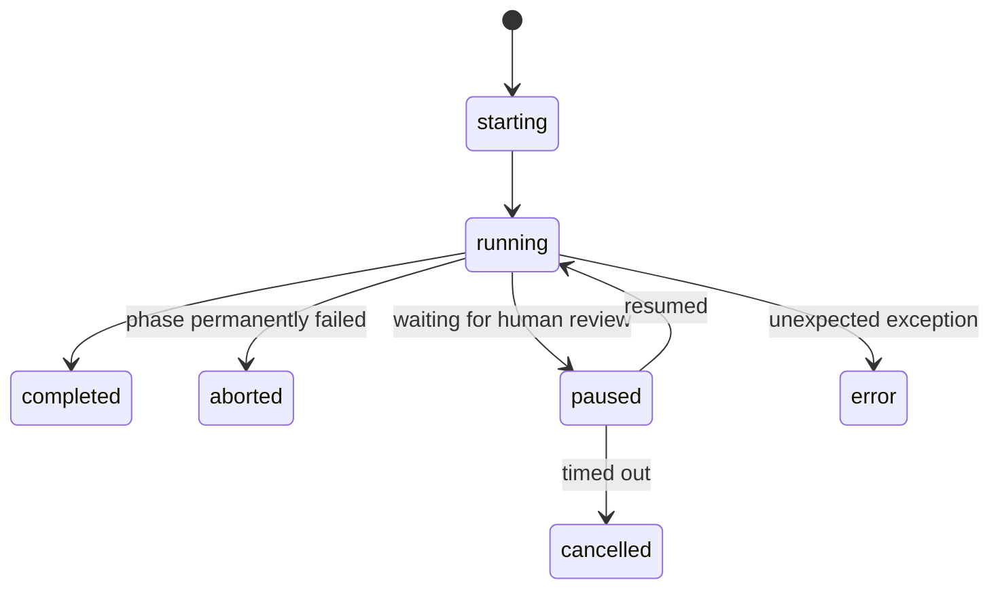

# Web UI — `orch serve`

> **Audience:** Users who want to run and monitor pipelines through a browser interface instead of the CLI. No coding required.

---

## Overview

The Orchestration Engine ships with a built-in local web UI powered by [FastAPI](https://fastapi.tiangolo.com/). It lets you browse templates, start pipeline runs, watch phase progress in real time, inspect phase outputs, and resume paused (human-in-the-loop) pipelines — all from a browser tab.

The server runs **locally on your machine**. It is not intended for public deployment; it is a developer and operator tool.

---

## Starting the Server

```bash
orch serve
```

By default the server listens on `http://localhost:8000`. Open that URL in your browser to access the UI.

**Options:**

```bash
orch serve --host 0.0.0.0   # listen on all interfaces (e.g. for LAN access)
orch serve --port 9000       # use a custom port
orch serve --reload          # auto-reload on code changes (development mode)
```

**Dependencies:** The web UI requires `fastapi`, `uvicorn`, and `sse-starlette`. Install them with:

```bash
pip install orchestration-engine[web]
```

If those packages are not installed, `orch serve` will print a clear error and exit.

---

## Available Endpoints

The server exposes **two independent API surfaces**:

### Web UI API (`/api/`)

These endpoints power the browser-based frontend (`app.py`):

| Method | Path | Description |
|--------|------|-------------|
| `GET` | `/` | Serves the web UI (HTML single-page app) |

| Method | Path | Description |
|--------|------|-------------|
| `GET` | `/api/health` | Health check; returns `{"status": "ok", "version": "..."}` |
| `GET` | `/api/templates` | List all discoverable pipeline templates |
| `GET` | `/api/templates/{name}` | Detail for a single template (phases, schema, example input) |
| `POST` | `/api/run` | Start a pipeline run; returns a `run_id` |
| `GET` | `/api/run/{run_id}/status` | **SSE stream** — live phase-completion events for a run |
| `GET` | `/api/run/{run_id}/outputs` | All stored phase outputs for a run (completed or in progress) |
| `POST` | `/api/run/{run_id}/resume` | Resume a paused (human-in-the-loop) pipeline run |
| `POST` | `/api/run/{run_id}/edit` | Edit a phase output before resuming a paused run |

### Versioned REST API (`/api/v1/`)

A separate, programmatic REST API exists at `/api/v1/` (served by `api.py`). This API is designed for CLI integration, webhooks, and external tooling. It provides **33 endpoints** covering:

- **Templates** — full CRUD (list, get, create, update, delete, validate)
- **Pipeline Runs** — launch, list, status, children, logs, SSE streaming, delete
- **Webhooks & Triggers** — receive webhook payloads, CRUD trigger configurations
- **Human Reviews** — list pending reviews, approve, reject
- **Cost Tracking** — daily summaries, per-run breakdowns
- **Trust Profiles** — list, get, update profiles and view adjustment history
- **Integrations** — Telegram HITL callback, GitHub issue automation

The versioned API is auto-documented via FastAPI's built-in OpenAPI. When running `orch serve` or `orch api-server`, visit `/api/v1/docs` in your browser for the interactive Swagger UI.

> **Which API should I use?** Use `/api/` if you're building a custom frontend. Use `/api/v1/` for programmatic integrations, webhooks, and automation.

---

## Starting a Run

`POST /api/run` accepts a JSON body:

```json
{
  "template": "content-pipeline",
  "mode": "dry-run",
  "input": {
    "topic": "AI safety",
    "tone": "professional"
  },
  "pause_after": ["draft"]
}
```

**Fields:**

| Field | Type | Default | Description |
|-------|------|---------|-------------|
| `template` | string | required | Template name (file stem) or template `id` field |
| `mode` | string | `"dry-run"` | Execution mode: `dry-run`, `standalone`, or `openclaw` |
| `input` | object | `{}` | Initial input values passed to the pipeline |
| `pause_after` | list[string] | `[]` | Phase IDs after which to pause for human review |

Returns:
```json
{"run_id": "3f8a1c2d-..."}
```

Use the returned `run_id` to subscribe to the SSE stream and retrieve outputs.

---

## Live Progress (Server-Sent Events)

`GET /api/run/{run_id}/status` returns an SSE stream. Each event is a JSON object with a `type` field:

| Event type | When it fires | Key fields |
|------------|---------------|------------|
| `start` | Pipeline begins | `run_id`, `template`, `mode` |
| `phase_start` | A phase begins executing | `phase_id`, `phase_name`, `model_tier`, `wave` |
| `phase_complete` | A phase succeeds | `phase_id`, `status`, `tokens_in`, `tokens_out`, `cost_usd`, `elapsed_seconds`, `output_preview` |
| `phase_error` | A phase fails | `phase_id`, `status`, `error_message` |
| `paused` | Pipeline paused at a human gate | `phase_id`, `output_preview` |
| `complete` | All phases finished | `phases` (count) |
| `aborted` | Pipeline aborted after a failure | `failed_phase` |
| `error` | Unexpected exception | `message` |
| `pipeline_complete` | Final summary event | `status`, `total_phases`, `completed`, `failed`, `total_tokens`, `total_cost`, `total_elapsed` |

**Example (JavaScript):**
```javascript
const source = new EventSource(`/api/run/${runId}/status`);
source.onmessage = (event) => {
  const data = JSON.parse(event.data);
  console.log(data.type, data);
};
```

---

## What You Can Do in the UI

- **Browse templates** — see all installed pipeline templates, their phase counts, categories, and descriptions.
- **Inspect a template** — view phase-by-phase execution plan, model tiers, and expected inputs before running.
- **Start a run** — pick a template, choose an execution mode (`dry-run` / `standalone` / `openclaw`), fill in input fields, and launch.
- **Watch progress live** — phases light up as they start and complete; tokens, cost, and elapsed time update in real time via SSE.
- **Read phase outputs** — click any completed phase to see a preview of its output.
- **Resume paused pipelines** — when a pipeline is paused at a `human_review` gate or a `pause_after` phase, review the output and click **Resume** (or **Edit & Resume** to modify the output before continuing).

---

## Human-in-the-Loop Workflow

To pause a pipeline after a specific phase:

1. Include the phase ID in `pause_after` when starting the run (via the UI or the API).
2. When the phase completes, the SSE stream emits a `paused` event.
3. The UI displays the phase output and a **Resume** button.
4. Optionally edit the output with `POST /api/run/{run_id}/edit` before resuming.
5. Click **Resume** (or call `POST /api/run/{run_id}/resume`) to continue.

Paused pipelines auto-expire after **1 hour** of inactivity (the background thread times out and the run is marked `cancelled`).

---

## Run Lifecycle



Completed runs are kept in memory for **1 hour** before being purged.

---

## Security Notes

- The server has no authentication. Only run it on `localhost` (the default) or a trusted network.
- CORS is open (`*`) for convenience during local development.
- Do **not** expose `orch serve` on a public interface without adding your own authentication layer.

---

## Troubleshooting

| Problem | Fix |
|---------|-----|
| `ModuleNotFoundError: fastapi` | Run `pip install orchestration-engine[web]` |
| Port already in use | Use `orch serve --port <other-port>` |
| Templates not appearing | Ensure templates are in `~/.orchestration-engine/templates/` or the current directory |
| SSE stream disconnects immediately | Check browser console; the run may have errored before producing any events |
